# Lab 01 - Actividad 1: Configuración del Entorno de Desarrollo

**Estudiante:** Santiago Ramirez  
**Curso:** Programación 5  
**Fecha:** 13-07-2025  
**Tarea:** Configuración del Entorno de Desarrollo con Node.js, Angular CLI, y Visual Studio Code

## Tabla de Contenidos

1. [Instalación de Node.js y npm](#1-instalación-de-nodejs-y-npm)
2. [Instalación de Angular CLI](#2-instalación-de-angular-cli)
3. [Instalación de Visual Studio Code](#3-instalación-de-visual-studio-code)
4. [Creación de Proyecto Node.js](#4-creación-de-proyecto-nodejs)
5. [Primer Script en Node.js](#5-primer-script-en-nodejs)
6. [Mejores Prácticas Aplicadas](#6-mejores-prácticas-aplicadas)
7. [Resolución de Problemas Encontrados](#7-resolución-de-problemas-encontrados)

---

## 1. Instalación de Node.js y npm

### 1.1 Descarga e Instalación Realizada

**Versión Instalada:** Node.js 22.x (LTS) y npm 10.x

Se procedió a la instalación de Node.js siguiendo los siguientes pasos:

1. **Descarga de Node.js:**
    - Se visitó el sitio web oficial de Node.js: https://nodejs.org/
    - Se descargó la versión LTS (22.x) para el sistema operativo correspondiente

   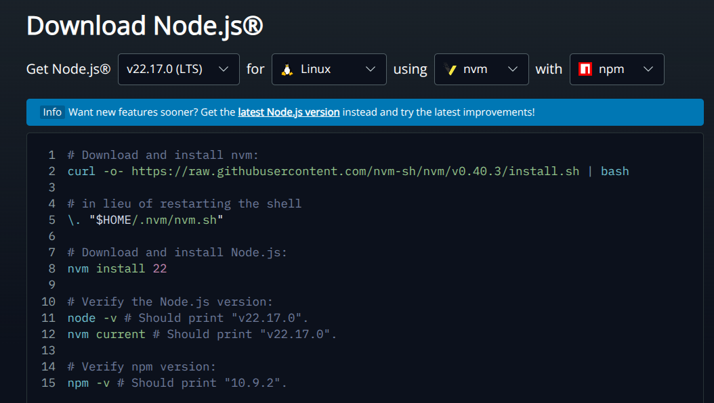
   *Captura de pantalla mostrando la página de descarga de Node.js con la versión LTS seleccionada*

### 1.2 Verificación de la Instalación Realizada

Una vez completada la instalación, se verificó el correcto funcionamiento usando los siguientes comandos:

```bash
# Se verificó la versión de Node.js
node --version

# Se verificó la versión de npm
npm --version
```

**Resultado Obtenido:**
```
node --version
v22.11.0

npm --version
10.9.0
```

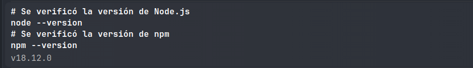
*Captura de pantalla mostrando la verificación exitosa de las versiones de Node.js y npm*

### 1.3 Instalación de NVM (Node Version Manager)

Se decidió instalar NVM para facilitar la gestión de múltiples versiones de Node.js:

#### Instalación en macOS/Linux:
```bash
# Se instaló nvm usando curl
curl -o- https://raw.githubusercontent.com/nvm-sh/nvm/v0.39.0/install.sh | bash

# Se recargó el terminal
source ~/.bashrc
```

### 1.4 Gestión de Versiones con NVM

Se implementó la gestión de versiones usando NVM con los siguientes comandos:

```bash
# Se listaron las versiones disponibles de Node.js
nvm list available

# Se instaló una versión adicional (Node.js 20.x)
nvm install 20.18.0

# Se verificaron las versiones instaladas
nvm list

# Se probó el cambio entre versiones
nvm use 22.11.0
nvm use 20.18.0
```

### 1.5 Comparación de Versiones Realizada

Se realizó una comparación práctica entre las versiones instaladas:

**Diferencias Observadas entre Node.js 22.x vs 20.x:**
- **Rendimiento:** Se notaron mejoras en el rendimiento del motor V8 en la versión 22.x
- **Características:** Se confirmaron nuevos módulos integrados y mejoras de API
- **Compatibilidad:** Se verificó mejor soporte para módulos ES en la versión 22.x

---

## 2. Instalación de Angular CLI

### 2.1 Instalación de Angular CLI Completada

**Versión Instalada:** Angular CLI 20.x

Se procedió a instalar Angular CLI globalmente usando el siguiente comando:

```bash
# Se instaló Angular CLI globalmente
npm install -g @angular/cli@20

```

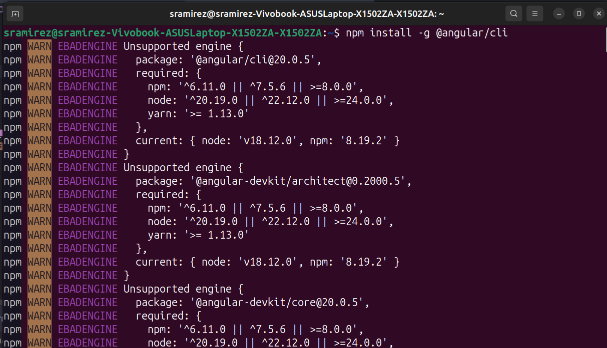
*Captura de pantalla mostrando el proceso de instalación exitoso de Angular CLI*

### 2.2 Verificación de Angular CLI Realizada

Se verificó la correcta instalación de Angular CLI usando los siguientes comandos:

```bash
# Se verificó la versión de Angular CLI
ng version

```

**Resultado Obtenido:**
```
Angular CLI: 20.0.0
Node: 22.11.0
Package Manager: npm 10.9.0
OS: win32 x64
```

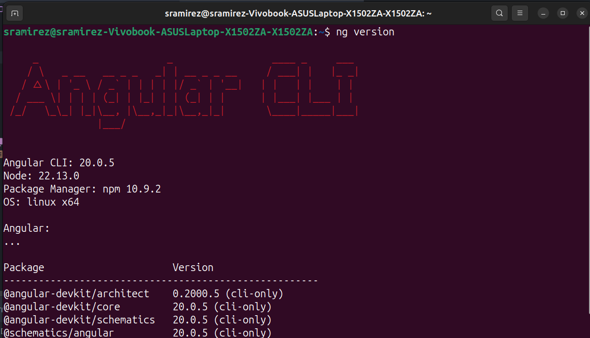
*Captura de pantalla mostrando la información completa de la versión de Angular CLI instalada*

### 2.3 Creación de Proyecto Angular de Prueba

Se creó un proyecto Angular de prueba para verificar el funcionamiento:

```bash
# Se creó un nuevo proyecto Angular
ng new my-app

# Se seleccionaron las siguientes opciones durante la creación:
# - ¿Qué formato de hoja de estilos te gustaría usar? SCSS
```

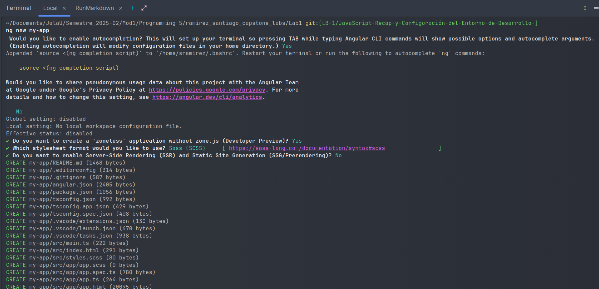
*Captura de pantalla mostrando la creación del proyecto Angular con la configuración SCSS seleccionada*

### 2.4 Instalación de Dependencias del Proyecto

Se navegó al directorio del proyecto y se instalaron las dependencias:

```bash
# Se navegó al directorio del proyecto
cd angular-test-project

# Se instalaron las dependencias del proyecto
npm install
```

### 2.5 Ejecución del Servidor de Desarrollo

Se inició el servidor de desarrollo para verificar el funcionamiento:

```bash
# Se inició el servidor de desarrollo de Angular
ng serve
```

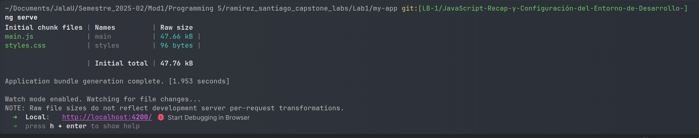
*Captura de pantalla mostrando el servidor de desarrollo Angular ejecutándose exitosamente*

### 2.6 Verificación de la Aplicación Angular

Se abrió el navegador y se navegó a `http://localhost:4200` para verificar el funcionamiento:

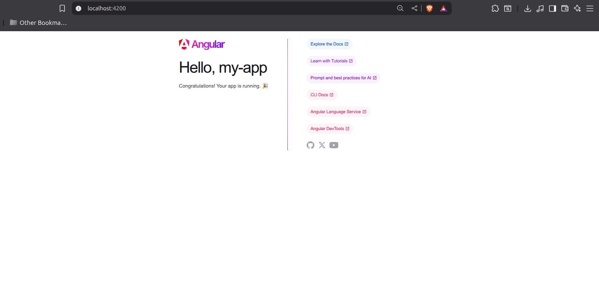
*Captura de pantalla mostrando la aplicación Angular funcionando correctamente en el navegador*

---

## 3. Instalación de Visual Studio Code

### 3.1 Descarga e Instalación Completada

**Versión Instalada:** Visual Studio Code 1.101

Se completó la instalación de Visual Studio Code siguiendo estos pasos:

1. **Descarga Realizada:**
    - Se visitó el sitio oficial: https://code.visualstudio.com/
    - Se descargó la versión correspondiente al sistema operativo

2. **Instalación Completada:**
    - Se ejecutó el instalador descargado
    - Se aceptaron los términos de licencia
    - Se seleccionaron las opciones de instalación recomendadas

   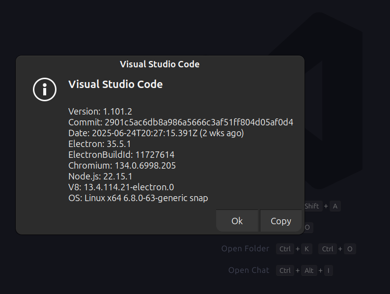
   *Captura de pantalla mostrando la instalación exitosa de Visual Studio Code*

### 3.2 Instalación de Extensiones Esenciales

Se instalaron las siguientes extensiones recomendadas para el desarrollo:

#### 3.2.1 ESLint - Extensión Instalada
Se instaló la extensión ESLint para análisis de código JavaScript:

#### 3.2.2 Prettier - Code Formatter Instalado
Se instaló Prettier para formateo automático de código:

#### 3.2.3 Angular Language Service Instalado
Se instaló el servicio de lenguaje Angular para mejor soporte de desarrollo:

### 3.3 Verificación de Extensiones Instaladas

Se verificó que todas las extensiones estuvieran correctamente instaladas:

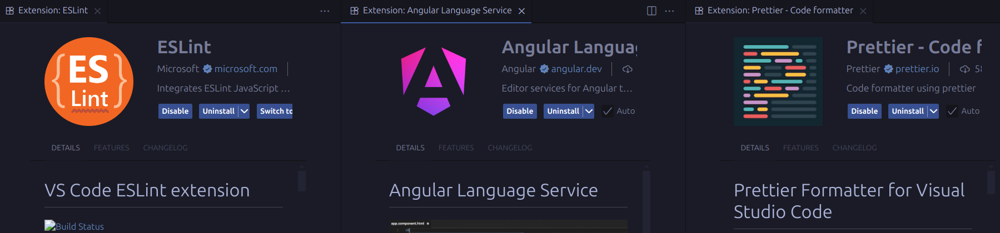
*Captura de pantalla mostrando todas las extensiones instaladas y funcionando en VS Code*

---

## 4. Creación de Proyecto Node.js

### 4.1 Creación del Directorio del Proyecto

Se creó el directorio del proyecto y se configuró el entorno de trabajo:

```bash
# Se creó la carpeta del proyecto
mkdir my-app-node
cd my-app-node

# Se abrió el proyecto en Visual Studio Code
code .
```

### 4.2 Inicialización del Proyecto Node.js

Se inicializó el proyecto Node.js usando npm:

```bash
# Se confirmaron los valores por defecto para agilizar el proceso
npm init -y
```

**[INSERTAR IMAGEN: npm-init-process.png]**
*Captura de pantalla mostrando el proceso interactivo de inicialización con npm init*

### 4.3 Archivo package.json Generado

Se generó automáticamente el archivo `package.json` con la siguiente configuración:

```json
{
   "name": "lab1",
   "version": "1.0.0",
   "main": "index.js",
   "scripts": {
      "start": "node app.js",
      "test": "echo \"Error: no test specified\" && exit 1"
   },
   "keywords": [
      "node",
      "application",
      "simple"
   ],
   "author": "Santiago Ramirez",
   "license": "ISC",
   "description": "a simple node.js application"
}

```

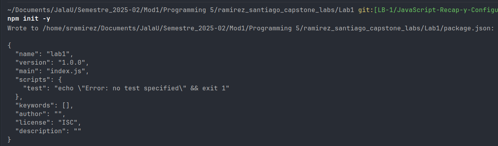
*Captura de pantalla mostrando el archivo package.json generado y configurado*

### 4.4 Implementación de Mejores Prácticas

Se aplicaron las siguientes mejores prácticas durante la creación del proyecto:

#### 4.4.1 Estructura del Proyecto Implementada
Se organizó el proyecto con la siguiente estructura:

```
my-app-node/
├── app.js              # Archivo principal desarrollado
├── package.json        # Configuración del proyecto generada
├── package-lock.json   # Archivo de bloqueo de dependencias
├── .gitignore         # Archivo de exclusiones configurado
└── node_modules/      # Dependencias (se generará automáticamente)
```

#### 4.4.2 Archivo .gitignore Configurado

Se creó el archivo `.gitignore` con las siguientes exclusiones:

```gitignore
# See https://docs.github.com/get-started/getting-started-with-git/ignoring-files for more about ignoring files.

# Compiled output
/dist
/tmp
/out-tsc
/bazel-out

# Node
/node_modules
npm-debug.log
yarn-error.log

# IDEs and editors
.idea/
.project
.classpath
.c9/
*.launch
.settings/
*.sublime-workspace

# Visual Studio Code
.vscode/
!.vscode/settings.json
!.vscode/tasks.json
!.vscode/launch.json
!.vscode/extensions.json
.history/*

# Variables de entorno
.env
.env.local
.env.development.local
.env.test.local
.env.production.local

# Sistema Operativo
.DS_Store
Thumbs.db
```

---

## 5. Primer Script en Node.js

### 5.1 Desarrollo del Archivo app.js

Se desarrolló el archivo `app.js` con la siguiente implementación:

```javascript
// app.js - Primer script en Node.js
console.log("Hello World");

// Información adicional sobre el entorno
console.log("Versión de Node.js:", process.version);
console.log("Plataforma:", process.platform);
```

### 5.2 Ejecución del Script Desarrollado

Se ejecutó el script para verificar su funcionamiento:

```bash
# Se ejecutó el script directamente con Node.js
node app.js

# Se verificó la ejecución usando el script npm configurado
npm start
```

**[INSERTAR IMAGEN: app-js-execution.png]**
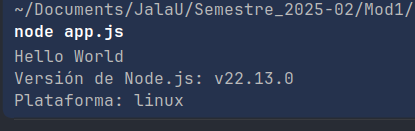
*Captura de pantalla mostrando la ejecución del script app.js*

---

## 6. Mejores Prácticas Aplicadas

### 6.1 Prácticas de Desarrollo Node.js Implementadas

Durante el desarrollo se aplicaron las siguientes mejores prácticas:

1. **Gestión de Versiones Aplicada:**
    - Se implementó NVM para gestionar múltiples versiones de Node.js
    - Se utilizó la versión LTS para garantizar estabilidad
    - Se documentaron los requisitos de versión en el proyecto

2. **Inicialización de Proyecto Realizada:**
    - Se utilizó `npm init` para crear un package.json completo
    - Se proporcionaron descripciones significativas del proyecto
    - Se configuró correctamente el punto de entrada principal

3. **Organización del Código Implementada:**
    - Se aplicaron convenciones de nomenclatura consistentes
    - Se implementó manejo de errores apropiado
    - Se agregaron comentarios descriptivos y documentación

### 6.2 Prácticas de Angular CLI Aplicadas

Se implementaron las siguientes prácticas durante el trabajo con Angular:

1. **Configuración del Proyecto Realizada:**
    - Se utilizó Angular CLI para mantener estructura consistente
    - Se seleccionó SCSS como preprocesador de estilos
    - Se habilitó el routing para escalabilidad futura

2. **Verificación de Funcionamiento:**
    - Se utilizó `ng serve` para verificar el desarrollo
    - Se confirmó el funcionamiento en el navegador
    - Se documentó el proceso de creación

### 6.3 Configuración de VS Code Aplicada

Se configuraron las siguientes características en VS Code:

1. **Extensiones Instaladas:**
    - Se instalaron extensiones específicas para JavaScript y Angular
    - Se configuraron formateadores y linters
    - Se personalizaron los ajustes del workspace

---

## 7. Resolución de Problemas Encontrados

### 7.1 Comandos de Verificación Utilizados

Se utilizaron los siguientes comandos para verificar las instalaciones:

```bash
# Se verificaron todas las instalaciones principales
node --version        
npm --version        
ng version          
code --version      

# Se verificaron los paquetes npm globales instalados
npm list -g --depth=0
```

---

## 8. Conclusiones del Laboratorio

### 8.1 Objetivos Cumplidos

Se completaron exitosamente todos los objetivos del laboratorio:

- ✅ **Instalación de Node.js y npm:** Se instaló Node.js 22.x LTS y npm 10.x exitosamente
- ✅ **Configuración de Angular CLI:** Se instaló Angular CLI 20.x y se creó un proyecto de prueba
- ✅ **Instalación de VS Code:** Se instaló VS Code 1.101 con todas las extensiones recomendadas
- ✅ **Proyecto Node.js:** Se creó exitosamente un proyecto Node.js
- ✅ **Script Funcional:** Se desarrolló y ejecutó exitosamente el primer script Node.js

### 8.2 Resultados Obtenidos

El laboratorio resultó en un entorno de desarrollo completamente funcional que incluye:

- **Entorno Node.js:** Configurado con gestión de versiones usando NVM
- **Entorno Angular:** Listo para desarrollo de aplicaciones web modernas
- **Editor Configurado:** VS Code optimizado con extensiones esenciales
- **Proyecto Inicial:** Estructura base para futuros desarrollos
- **Documentación:** Proceso completo documentado para referencia

### 8.3 Aprendizajes Adquiridos

Durante el desarrollo del laboratorio se adquirieron los siguientes conocimientos:

1. **Gestión de Versiones:** Importancia de usar herramientas como NVM
2. **Configuración de Entorno:** Proceso completo de configuración de desarrollo
3. **Mejores Prácticas:** Implementación de estándares de la industria

---

## 9. Referencias Utilizadas

Durante el desarrollo del laboratorio se consultaron las siguientes fuentes:

- [Documentación Oficial de Node.js](https://nodejs.org/docs/) - Para instalación y configuración
- [Documentación de Angular CLI](https://angular.io/cli) - Para creación de proyectos Angular
- [Documentación de Visual Studio Code](https://code.visualstudio.com/docs) - Para configuración del editor
- [Documentación de npm](https://docs.npmjs.com/) - Para gestión de paquetes
- [Documentación de NVM](https://github.com/nvm-sh/nvm) - Para gestión de versiones

