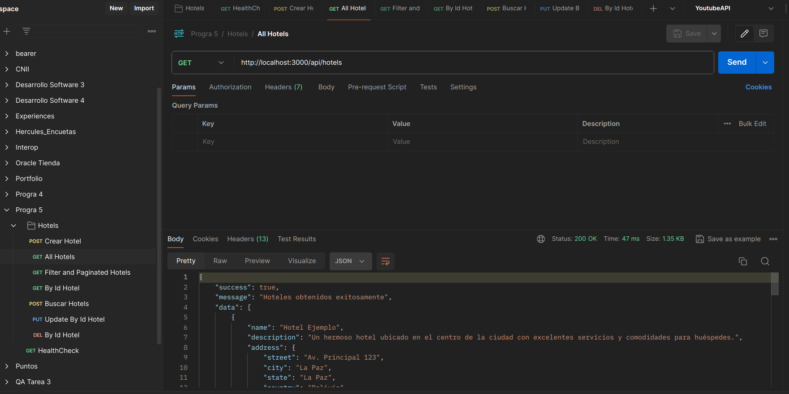
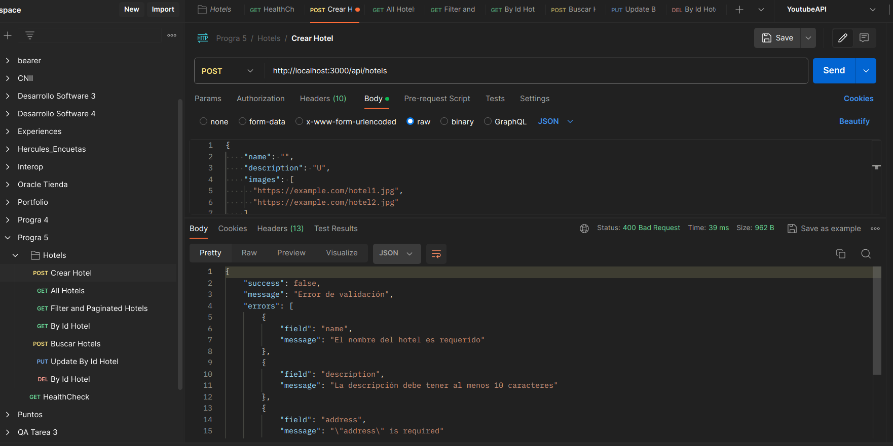
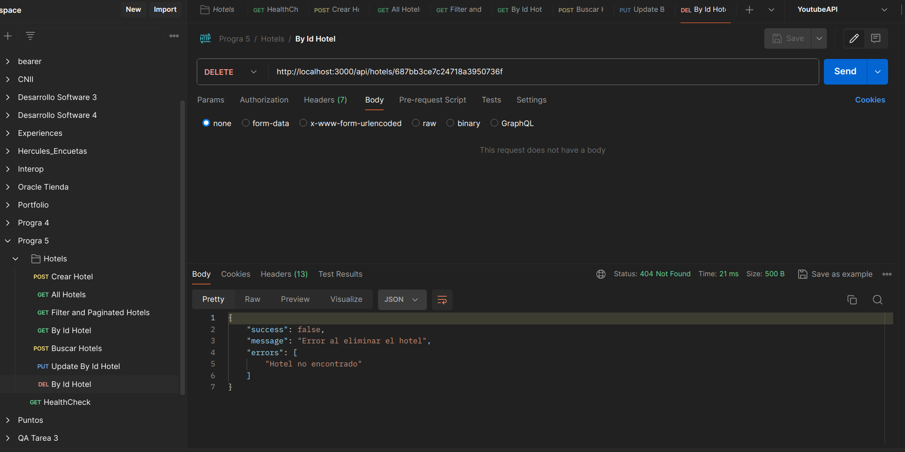
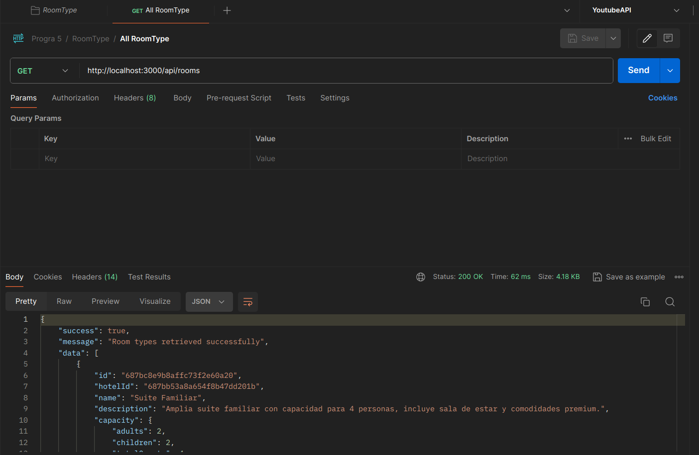
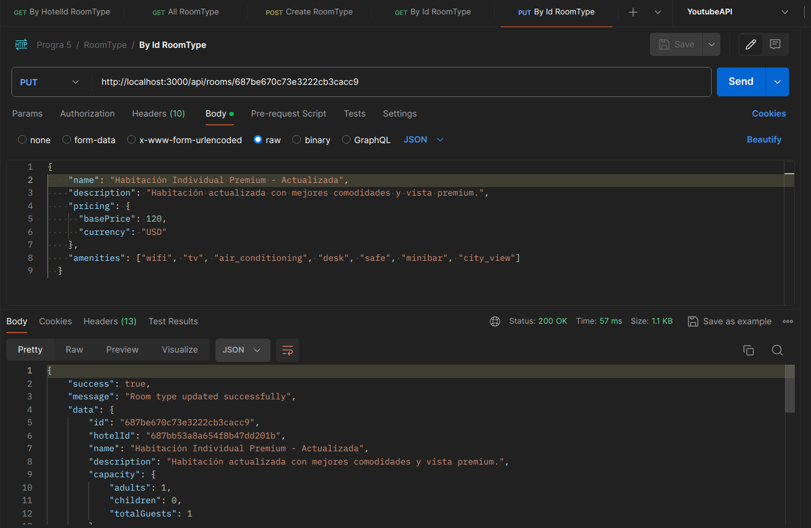
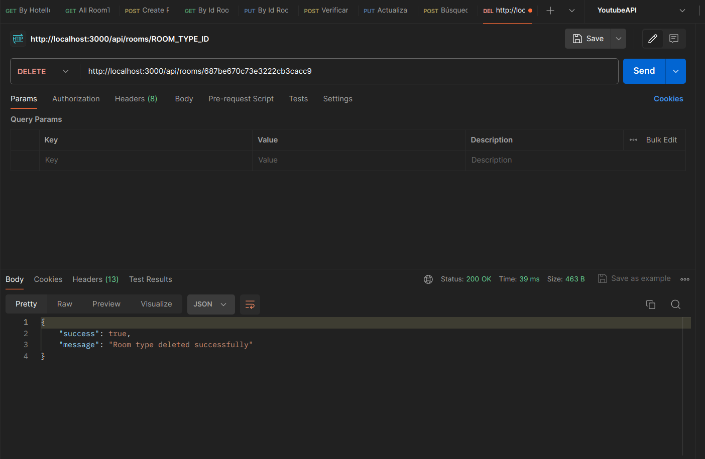
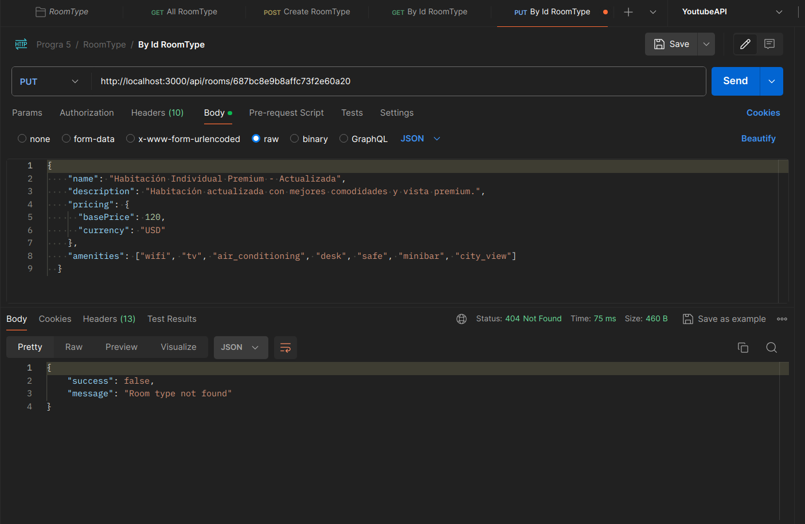

# Laboratorio Semana 2: Backend Fundamentos
## Actividad 3: Implementación de Operaciones CRUD

### Descripción General

Se han implementado operaciones CRUD completas para dos recursos principales del sistema de reservas de hoteles:
- **Hoteles**: Gestión completa de información hotelera
- **Tipos de Habitaciones (RoomTypes)**: Administración de diferentes tipos de habitaciones por hotel

La implementación sigue una **arquitectura por capas (Clean Architecture)** con separación clara de responsabilidades y persistencia en **MongoDB** en lugar de almacenamiento en memoria.

---

## 📁 Estructura de Archivos Implementados

### Hoteles (Hotels)
```
src/
├── domain/
│   ├── entities/Hotel.js              # Entidad del dominio
│   ├── repositories/HotelRepository.js # Interfaz del repositorio
│   └── usecases/HotelUseCases.js      # Casos de uso/lógica de negocio
├── infrastructure/
│   ├── database/models/Hotel.js       # Modelo MongoDB
│   └── repositories/MongoHotelRepository.js # Implementación repositorio
├── interfaces/
│   ├── controllers/hotelController.js  # Controlador HTTP
│   └── routes/hotelRoutes.js          # Definición de rutas
└── shared/
    └── validators/hotelValidators.js   # Validadores Joi
```

### Tipos de Habitaciones (RoomTypes)
```
src/
├── domain/
│   ├── entities/RoomType.js              # Entidad del dominio
│   ├── repositories/RoomTypeRepository.js # Interfaz del repositorio
│   └── usecases/RoomTypeUseCases.js      # Casos de uso/lógica de negocio
├── infrastructure/
│   ├── database/models/RoomType.js       # Modelo MongoDB
│   └── repositories/MongoRoomTypeRepository.js # Implementación repositorio
├── interfaces/
│   ├── controllers/roomTypeController.js  # Controlador HTTP
│   └── routes/roomTypeRoutes.js          # Definición de rutas
└── shared/
    └── validators/roomTypeValidators.js   # Validadores Joi
```

---

## 🏨 Endpoints Implementados para Hoteles

### **GET /api/hotels** - Obtener todos los hoteles

**Descripción**: Retorna una lista paginada de hoteles con filtros opcionales.

**Parámetros Query**:
- `page`: Número de página (default: 1)
- `limit`: Elementos por página (default: 10)
- `city`: Filtrar por ciudad
- `country`: Filtrar por país
- `minRating`: Rating mínimo
- `amenities`: Amenidades separadas por comas

**Respuesta Exitosa (200)**:
```json
{
  "success": true,
  "message": "Hotels retrieved successfully",
  "data": [
    {
      "_id": "507f1f77bcf86cd799439011",
      "name": "Hotel Ejemplo",
      "description": "Un hermoso hotel...",
      "address": {
        "street": "Av. Principal 123",
        "city": "La Paz",
        "country": "Bolivia"
      },
      "contact": {
        "phone": "+591-2-123-4567",
        "email": "contacto@hotel.com"
      },
      "amenities": ["WiFi", "Pool", "Gym"],
      "createdAt": "2024-01-15T10:30:00Z"
    }
  ],
  "pagination": {
    "page": 1,
    "limit": 10,
    "total": 25,
    "pages": 3
  }
}
```

### **GET /api/hotels/:id** - Obtener hotel por ID

**Descripción**: Retorna los detalles de un hotel específico.

**Parámetros**:
- `id`: ID del hotel (MongoDB ObjectId)

**Respuesta Exitosa (200)**:
```json
{
  "success": true,
  "message": "Hotel retrieved successfully",
  "data": {
    "_id": "507f1f77bcf86cd799439011",
    "name": "Hotel Ejemplo",
    "description": "Descripción completa del hotel...",
    "address": {
      "street": "Av. Principal 123",
      "city": "La Paz",
      "state": "La Paz",
      "country": "Bolivia",
      "zipCode": "0001"
    },
    "contact": {
      "phone": "+591-2-123-4567",
      "email": "contacto@hotel.com",
      "website": "https://hotel.com"
    },
    "amenities": ["WiFi", "Pool", "Gym", "Restaurant"],
    "policies": {
      "checkIn": "14:00",
      "checkOut": "12:00",
      "cancellation": "Cancelación gratuita hasta 24 horas"
    }
  }
}
```

### **POST /api/hotels** - Crear nuevo hotel

**Descripción**: Crea un nuevo hotel en el sistema.

**Body Requerido**:
```json
{
  "name": "Hotel Nuevo",
  "description": "Descripción del hotel (mínimo 10 caracteres)",
  "address": {
    "street": "Calle Principal 456",
    "city": "Cochabamba",
    "state": "Cochabamba",
    "country": "Bolivia",
    "zipCode": "0002"
  },
  "contact": {
    "phone": "+591-4-123-4567",
    "email": "info@hotelnuevo.com",
    "website": "https://hotelnuevo.com"
  },
  "amenities": ["WiFi", "Pool"],
  "policies": {
    "checkIn": "15:00",
    "checkOut": "11:00"
  }
}
```

**Respuesta Exitosa (201)**:
```json
{
  "success": true,
  "message": "Hotel created successfully",
  "data": {
    "_id": "507f1f77bcf86cd799439012",
    "name": "Hotel Nuevo",
    // ... resto de datos del hotel creado
    "createdAt": "2024-01-15T11:00:00Z",
    "updatedAt": "2024-01-15T11:00:00Z"
  }
}
```

### **PUT /api/hotels/:id** - Actualizar hotel

**Descripción**: Actualiza completamente la información de un hotel existente.

**Parámetros**:
- `id`: ID del hotel a actualizar

**Body**: Misma estructura que POST, todos los campos son opcionales.

**Respuesta Exitosa (200)**:
```json
{
  "success": true,
  "message": "Hotel updated successfully",
  "data": {
    // ... datos actualizados del hotel
    "updatedAt": "2024-01-15T12:00:00Z"
  }
}
```

### **DELETE /api/hotels/:id** - Eliminar hotel

**Descripción**: Elimina un hotel del sistema (soft delete).

**Parámetros**:
- `id`: ID del hotel a eliminar

**Respuesta Exitosa (200)**:
```json
{
  "success": true,
  "message": "Hotel deleted successfully"
}
```

### **POST /api/hotels/search** - Búsqueda avanzada

**Descripción**: Búsqueda de hoteles con criterios específicos.

**Body Requerido**:
```json
{
  "destination": "La Paz",
  "checkInDate": "2024-08-15",
  "checkOutDate": "2024-08-20",
  "guests": {
    "adults": 2,
    "children": 1
  },
  "filters": {
    "minRating": 4,
    "maxPrice": 200,
    "amenities": ["WiFi", "Pool"]
  }
}
```

---

## 🛏️ Endpoints Implementados para Tipos de Habitaciones

### **GET /api/rooms** - Obtener todos los tipos de habitaciones

**Descripción**: Retorna una lista paginada de tipos de habitaciones con filtros.

**Parámetros Query**:
- `page`: Número de página
- `limit`: Elementos por página
- `hotelId`: Filtrar por hotel específico
- `availability`: Filtrar por disponibilidad

**Respuesta Exitosa (200)**:
```json
{
  "success": true,
  "message": "Room types retrieved successfully",
  "data": [
    {
      "_id": "507f1f77bcf86cd799439013",
      "hotelId": "507f1f77bcf86cd799439011",
      "name": "Habitación Individual Standard",
      "description": "Cómoda habitación individual...",
      "capacity": {
        "adults": 1,
        "children": 0,
        "totalGuests": 1
      },
      "bedConfiguration": {
        "singleBeds": 1,
        "doubleBeds": 0,
        "sofaBeds": 0
      },
      "amenities": ["wifi", "tv", "air_conditioning"],
      "pricing": {
        "basePrice": 80,
        "currency": "USD"
      },
      "availability": true
    }
  ],
  "pagination": {
    "page": 1,
    "limit": 10,
    "total": 15,
    "pages": 2
  }
}
```

### **GET /api/rooms/:id** - Obtener tipo de habitación por ID

**Descripción**: Retorna los detalles de un tipo de habitación específico.

**Respuesta Exitosa (200)**:
```json
{
  "success": true,
  "message": "Room type retrieved successfully",
  "data": {
    "_id": "507f1f77bcf86cd799439013",
    "hotelId": "507f1f77bcf86cd799439011",
    "name": "Suite Familiar",
    "description": "Amplia suite familiar con capacidad para 4 personas",
    "capacity": {
      "adults": 2,
      "children": 2,
      "totalGuests": 4
    },
    "bedConfiguration": {
      "singleBeds": 0,
      "doubleBeds": 1,
      "sofaBeds": 1
    },
    "amenities": ["wifi", "tv", "minibar", "balcony", "city_view"],
    "images": [
      "https://example.com/family-suite1.jpg"
    ],
    "pricing": {
      "basePrice": 250,
      "currency": "USD",
      "discounts": [
        {
          "type": "family",
          "description": "Descuento especial para familias",
          "percentage": 20,
          "minNights": 2
        }
      ]
    },
    "availability": true,
    "hotel": {
      "name": "Hotel Ejemplo",
      "address": "Av. Principal 123, La Paz"
    }
  }
}
```

### **POST /api/rooms** - Crear nuevo tipo de habitación

**Descripción**: Crea un nuevo tipo de habitación para un hotel.

**Body Requerido**:
```json
{
  "hotelId": "507f1f77bcf86cd799439011",
  "name": "Habitación Doble Deluxe",
  "description": "Habitación doble con vista al mar y amenidades premium",
  "capacity": {
    "adults": 2,
    "children": 1,
    "totalGuests": 3
  },
  "bedConfiguration": {
    "singleBeds": 0,
    "doubleBeds": 1,
    "sofaBeds": 0
  },
  "amenities": ["wifi", "tv", "air_conditioning", "minibar", "ocean_view"],
  "images": [
    "https://example.com/deluxe-room1.jpg",
    "https://example.com/deluxe-room2.jpg"
  ],
  "pricing": {
    "basePrice": 150,
    "currency": "USD",
    "discounts": [
      {
        "type": "early_bird",
        "description": "Reserva anticipada",
        "percentage": 10,
        "minNights": 3
      }
    ]
  },
  "availability": true
}
```

**Respuesta Exitosa (201)**:
```json
{
  "success": true,
  "message": "Room type created successfully",
  "data": {
    "_id": "507f1f77bcf86cd799439014",
    // ... datos del tipo de habitación creado
    "createdAt": "2024-01-15T13:00:00Z"
  }
}
```

### **PUT /api/rooms/:id** - Actualizar tipo de habitación

**Descripción**: Actualiza la información de un tipo de habitación existente.

**Body**: Misma estructura que POST, campos opcionales.

### **DELETE /api/rooms/:id** - Eliminar tipo de habitación

**Descripción**: Elimina un tipo de habitación (soft delete).

### **GET /api/rooms/hotel/:hotelId** - Tipos por hotel

**Descripción**: Obtiene todos los tipos de habitaciones de un hotel específico.

### **POST /api/rooms/:id/availability** - Verificar disponibilidad

**Descripción**: Verifica disponibilidad para fechas específicas.

**Body**:
```json
{
  "checkInDate": "2024-08-15",
  "checkOutDate": "2024-08-20"
}
```

### **PUT /api/rooms/:id/pricing** - Actualizar precios

**Descripción**: Actualiza únicamente los precios y descuentos.

**Body**:
```json
{
  "basePrice": 180,
  "currency": "USD",
  "discounts": [
    {
      "type": "seasonal",
      "description": "Descuento de temporada baja",
      "percentage": 25,
      "validFrom": "2024-01-01",
      "validTo": "2024-03-31"
    }
  ]
}
```

### **POST /api/rooms/search** - Búsqueda avanzada

**Descripción**: Búsqueda de tipos de habitaciones con criterios múltiples.

**Body**:
```json
{
  "capacity": 2,
  "priceRange": {
    "min": 50,
    "max": 300
  },
  "amenities": ["wifi", "tv"],
  "checkInDate": "2024-08-15",
  "checkOutDate": "2024-08-20"
}
```

---

## 🧪 Pruebas Realizadas

Se han implementado archivos de prueba automatizados que verifican todos los endpoints:

### Archivo: `tests/hotel-endpoints-test.js`
- Tests completos para todos los endpoints de hoteles
- Casos positivos y negativos
- Validación de errores
- Limpieza automática de datos de prueba

### Archivo: `tests/roomtype-endpoints-test.js`
- Tests completos para todos los endpoints de tipos de habitaciones
- Gestión automática de dependencias (hotel requerido)
- Validación de relaciones entre entidades
- Casos de error y validación

### Ejecutar las Pruebas

```bash
# Iniciar el servidor
npm run dev

# En otra terminal, ejecutar pruebas de hoteles
node tests/hotel-endpoints-test.js

# Ejecutar pruebas de tipos de habitaciones
node tests/roomtype-endpoints-test.js
```

---

## 📸 Capturas de Pantalla Documentadas

Las siguientes capturas han sido tomadas durante las pruebas de los endpoints usando Thunder Client/Postman, demostrando tanto casos exitosos como manejo de errores:

### 🏨 Hoteles - Operaciones Exitosas

#### GET /api/hotels - Lista de Hoteles

*Captura mostrando la obtención exitosa de la lista de hoteles con paginación y filtros aplicados. Se puede observar la estructura de respuesta consistente con datos de hoteles, información de paginación y metadata.*

#### POST /api/hotels - Creación de Hotel

*Demostración de la creación exitosa de un nuevo hotel. La imagen muestra el body del request con todos los campos requeridos (nombre, descripción, dirección, contacto) y la respuesta exitosa con código 201 y los datos del hotel creado.*

#### PUT /api/hotels/:id - Actualización de Hotel

*Actualización exitosa de un hotel existente. Se observa cómo se pueden modificar campos específicos del hotel y la respuesta confirma los cambios realizados con el timestamp de actualización.*

#### DELETE /api/hotels/:id - Eliminación de Hotel

*Eliminación exitosa de un hotel mediante soft delete. La respuesta confirma que el hotel ha sido marcado como eliminado manteniendo la integridad referencial.*

### ❌ Hoteles - Casos de Error

#### POST /api/hotels - Error de Validación

*Ejemplo de manejo de errores de validación al intentar crear un hotel con datos incompletos o inválidos. Se muestran los mensajes de error detallados que ayudan al desarrollador a identificar qué campos faltan o son incorrectos.*

#### DELETE /api/hotels/:id - Hotel No Encontrado

*Error al intentar eliminar un hotel que no existe en la base de datos. La respuesta muestra el código de estado 404 y un mensaje claro indicando que el hotel no fue encontrado.*

### 🛏️ Tipos de Habitaciones - Operaciones Exitosas

#### GET /api/rooms - Lista de Tipos de Habitaciones

*Obtención exitosa de la lista de tipos de habitaciones disponibles. La respuesta incluye información detallada sobre capacidad, configuración de camas, amenidades, precios y relación con el hotel correspondiente.*

#### PUT /api/rooms/:id - Actualización de Tipo de Habitación

*Actualización exitosa de un tipo de habitación existente. Se pueden modificar campos como precio, amenidades, disponibilidad, y la respuesta confirma los cambios aplicados.*

#### DELETE /api/rooms/:id - Eliminación de Tipo de Habitación

*Eliminación exitosa de un tipo de habitación mediante soft delete. La operación mantiene la integridad de datos y permite recuperación posterior si es necesario.*

### ❌ Tipos de Habitaciones - Casos de Error

#### PUT /api/rooms/:id - Error de Validación en Actualización

*Error de validación al intentar actualizar un tipo de habitación con datos inválidos. Los mensajes de error especifican exactamente qué campos no cumplen con las reglas de validación establecidas (ej: capacidad inconsistente, precios negativos, amenidades no válidas).*

#### DELETE /api/rooms/:id - Tipo de Habitación No Encontrado

*Error al intentar eliminar un tipo de habitación que no existe. La respuesta HTTP 404 con mensaje descriptivo ayuda a identificar que el ID proporcionado no corresponde a ningún registro existente.*

---
````
