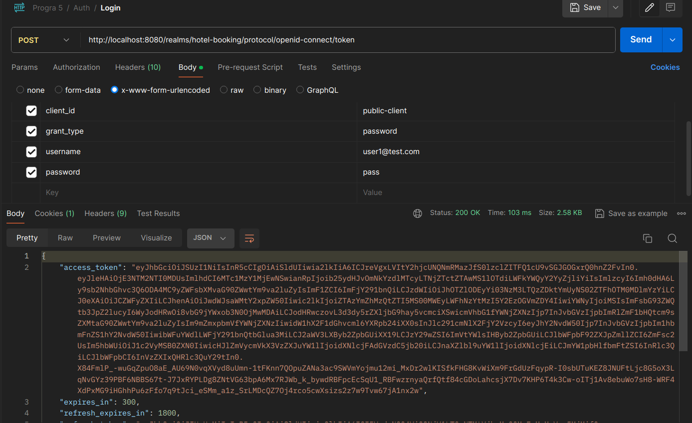
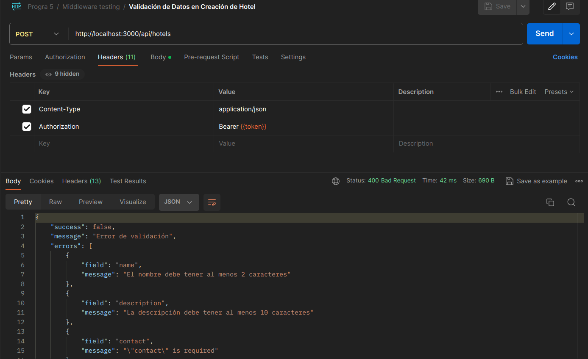
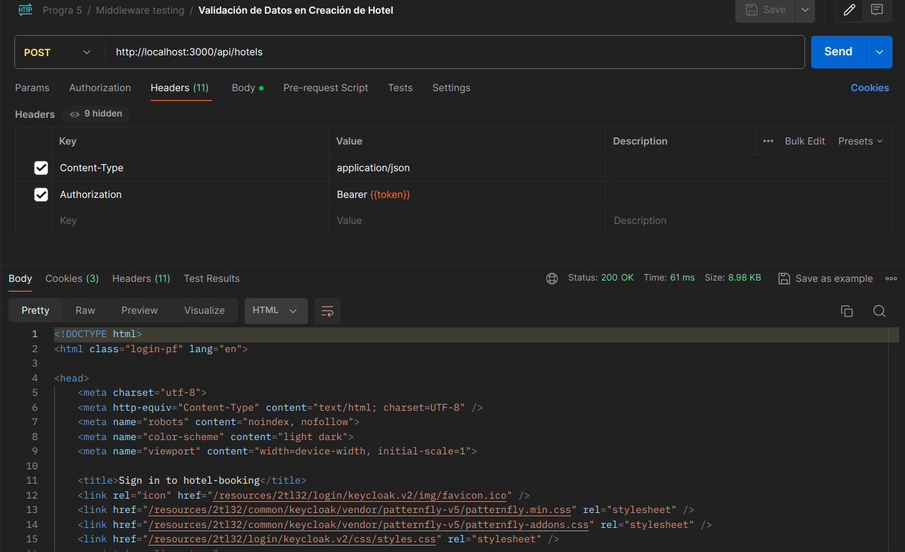
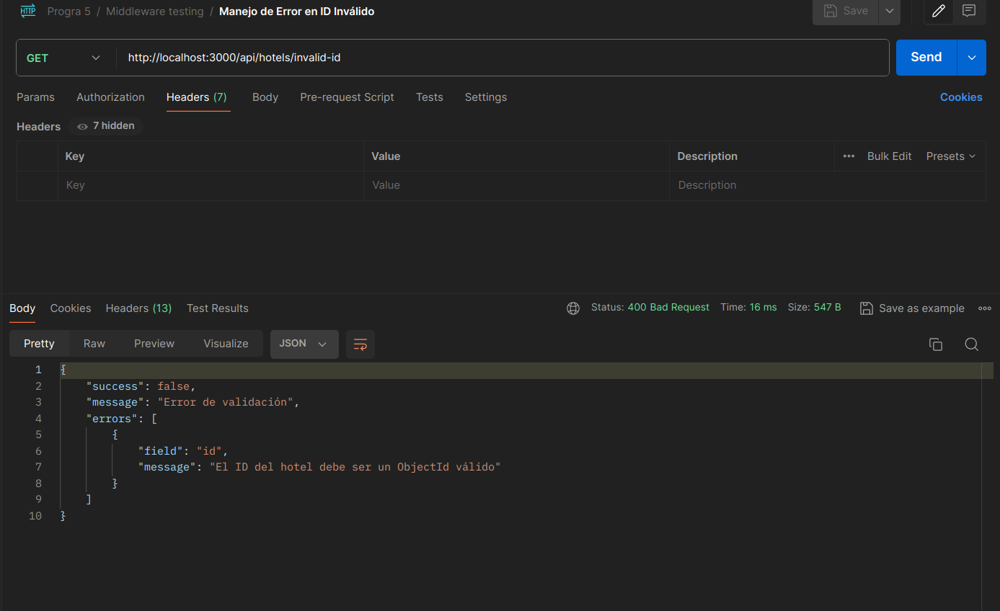

# Actividad 1: Implementación de Autenticación con Keycloak

## Descripción de la Actividad
Se implementó un sistema de autenticación para la API del sistema de reservas de hoteles utilizando Keycloak como proveedor de identidad. Esta implementación permite proteger rutas sensibles y gestionar los accesos de manera segura.

## Implementación

### 1. Configuración Inicial

Se instaló la dependencia necesaria para la integración con Keycloak:
- keycloak-connect: Para la integración con Keycloak

### 2. Archivo de Configuración de Keycloak

Se creó un archivo dedicado para la configuración de Keycloak en `src/infrastructure/auth/keycloak.js`:

```javascript
import KeycloakConnect from "keycloak-connect";

const keycloak = new KeycloakConnect(
    {},
    {
        "realm": "hotel-booking",
        "auth-server-url": "http://localhost:8080/",
        "ssl-required": "external",
        "resource": "public-client",
        "public-client": true,
        "confidential-port": 0
    }
);

export default keycloak;
```

Esta configuración simplificada:
- No requiere una configuración de sesión separada
- Utiliza un cliente público para simplificar la implementación
- Centraliza la configuración de Keycloak en un único archivo

### 3. Middleware de Autenticación

Se creó un middleware de autenticación (`authMiddleware.js`) que encapsula la funcionalidad de Keycloak para proteger las rutas:

```javascript
const authMiddleware = (keycloak) => {
  return {
    protect: () => keycloak.protect(),
    protectWithRole: (role) => keycloak.protect(role),
    enforcePermissions: (permissions, options = {}) => keycloak.enforcer(permissions, options)
  };
};
```

Este middleware proporciona tres funciones principales:
- `protect()`: Para proteger rutas que requieren autenticación básica
- `protectWithRole(role)`: Para proteger rutas que requieren roles específicos
- `enforcePermissions(permissions, options)`: Para implementar autorización basada en recursos

### 4. Integración con Express

Se actualizó el archivo `app.js` para integrar Keycloak con Express, importando directamente el módulo de keycloak:

```javascript
import keycloak from './infrastructure/auth/keycloak.js';
import authMiddleware from './infrastructure/middleware/authMiddleware.js';

// Configurar middleware de autenticación
app.use(keycloak.middleware());

// Crear instancia del middleware de autenticación
const auth = authMiddleware(keycloak);
```

Esta implementación es más limpia y no requiere configurar sesiones explícitamente.

### 5. Protección de Rutas

Se modificaron los archivos de rutas para aplicar la autenticación en los endpoints que requieren protección:

- En rutas de hoteles (`hotelRoutes.js`): Se protegieron los endpoints POST, PUT y DELETE mientras que los endpoints GET se mantuvieron públicos para permitir la consulta de información.

- En rutas de tipos de habitaciones (`roomTypeRoutes.js`): Se aplicó el mismo enfoque, protegiendo operaciones de escritura mientras se mantienen públicas las operaciones de lectura.

Ejemplo de protección de ruta:
```javascript
router.post('/',
  auth.protect(), // Protección con autenticación
  validateRequest(createHotelValidator, 'body'),
  createHotel
);
```

### 6. Configuración de Acceso Público para Búsquedas

Siguiendo los requisitos, se mantuvieron públicas las rutas de búsqueda de habitaciones para permitir a usuarios no autenticados buscar disponibilidad:

- `/api/hotels/search`
- `/api/hotels/search/fast` 
- `/api/rooms/hotel/:hotelId`
- `/api/rooms/:id/availability`

## Pruebas de Autenticación

Para probar la autenticación, se pueden utilizar las siguientes solicitudes en Postman:

### 1. Obtener un Token de Keycloak

```
POST http://localhost:8080/realms/hotel-booking/protocol/openid-connect/token
Content-Type: application/x-www-form-urlencoded

grant_type=password&client_id=public-client&username=admin&password=admin
```

### 2. Acceder a una Ruta Protegida

```
POST http://localhost:3000/api/hotels
Authorization: Bearer {token}
Content-Type: application/json

{
  "name": "Nuevo Hotel",
  "address": "Calle Principal 123",
  "city": "Ciudad Ejemplo",
  "country": "País Ejemplo",
  "stars": 4
}
```

### 3. Acceder a una Ruta Pública

```
GET http://localhost:3000/api/hotels
```

## Capturas de Pantalla

Las capturas de pantalla de las pruebas se encuentran en la carpeta `screenshots`:

- `auth-login-keycloak.png`: Obtención de token en Keycloak


- `auth-protected-route-success.png`: Acceso exitoso a una ruta protegida con token válido


- `auth-protected-route-failure.png`: Intento fallido de acceso a una ruta protegida sin token


- `auth-public-route.png`: Acceso a una ruta pública sin token


## Conclusión

La implementación de autenticación con Keycloak proporciona una capa de seguridad robusta para la API, permitiendo:

- Control granular de acceso a recursos
- Gestión centralizada de usuarios y roles
- Protección de endpoints sensibles
- Acceso público a información de búsqueda de habitaciones

Este enfoque sigue las mejores prácticas de seguridad permitiendo la consulta pública de información mientras se protegen las operaciones de escritura y modificación.
