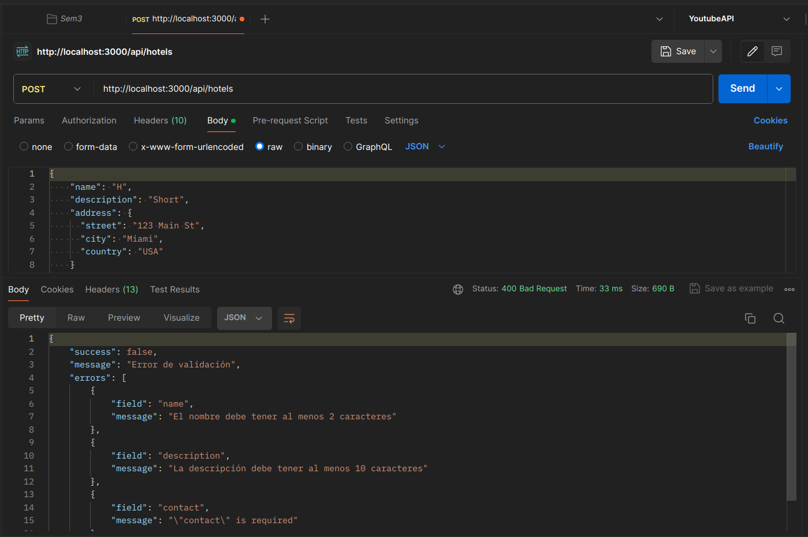
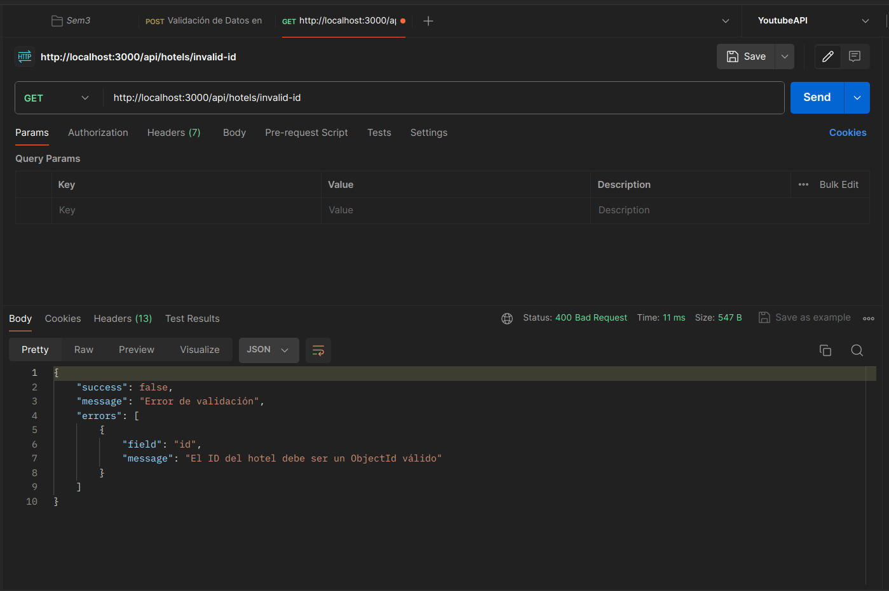
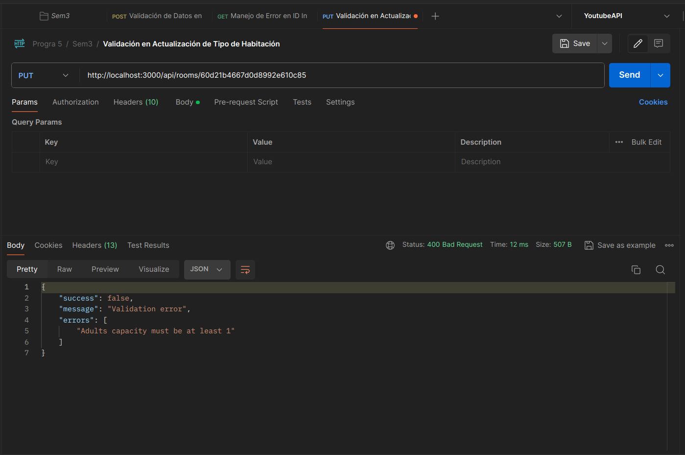
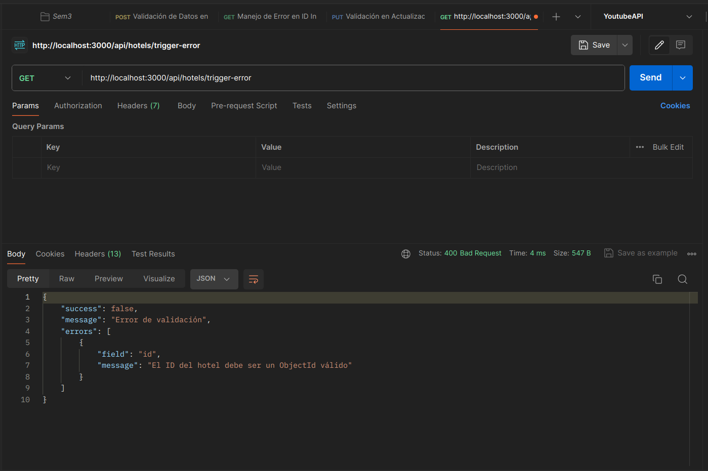

# Laboratorio 3 - Actividad 2: Middlewares y Manejo de Errores en Express

## Descripción de la Actividad
Implementación de middlewares en la API para mejorar su funcionalidad y robustez, incluyendo un manejo eficiente de errores.

## Implementaciones Realizadas

### 1. Middlewares de Validación

Se han implementado varios validadores utilizando Joi para validar el cuerpo de las solicitudes POST y PUT en los diferentes endpoints de la aplicación:

#### Validadores para Hoteles (`hotelValidators.js`)

Los validadores de hoteles garantizan que los datos proporcionados para la creación y actualización de hoteles cumplan con los requisitos definidos:

- **Validación de Creación**: Asegura que todos los campos requeridos estén presentes y tengan el formato correcto
- **Validación de Actualización**: Verifica que los campos enviados para actualizar cumplan con los requisitos de formato y valor

Los validadores implementan:
- Validación de estructuras anidadas (dirección, contacto, políticas)
- Restricciones de longitud para campos de texto
- Validación de formatos (email, URI, coordenadas)
- Mensajes de error personalizados para una mejor experiencia de usuario

#### Validadores para Tipos de Habitación (`roomTypeValidators.js`)

Se implementaron validadores similares para los tipos de habitación, asegurando la integridad de los datos:

- Validación del ID del hotel asociado (debe ser un ObjectId válido)
- Validación de nombres, descripciones y capacidades
- Verificación de precios y disponibilidad

#### Validadores para Búsqueda de Habitaciones (`roomSearchValidators.js`)

Implementación de validadores para las búsquedas, garantizando que los parámetros de búsqueda sean válidos:

- Validación de fechas (check-in y check-out)
- Validación del número de personas
- Validación de rangos de precios

### 2. Middleware de Logger (`logger.js`)

Se implementó un sistema de logging utilizando Winston para registrar eventos importantes:

- Configuración para diferentes niveles de log (info, error, debug)
- Formato legible con timestamp
- Configuración específica para entornos de desarrollo vs. producción
- Capacidad para registrar objetos complejos (metadatos)

### 3. Manejador Global de Errores (`errorHandler.js`)

Se implementó un sistema centralizado de manejo de errores que:

- Captura errores no manejados en las rutas
- Proporciona una clase `AppError` para crear errores personalizados con códigos de estado
- Maneja específicamente errores comunes de MongoDB (validación, casting, duplicados)
- Devuelve respuestas JSON estandarizadas con información del error
- Incluye información adicional de depuración en entorno de desarrollo
- Registra todos los errores a través del sistema de logging

El manejador de errores también incluye un wrapper (`asyncWrapper`) para simplificar el manejo de errores en funciones asíncronas.

## Pruebas Realizadas

### Prueba 1: Validación de Datos en Creación de Hotel

**Solicitud:**
```bash
curl -X POST http://localhost:3000/api/hotels \
  -H "Content-Type: application/json" \
  -d '{
    "name": "H",
    "description": "Short",
    "address": {
      "street": "123 Main St",
      "city": "Miami",
      "country": "USA"
    }
  }'
```

**Resultado esperado:** Error 400 indicando que el nombre debe tener al menos 2 caracteres y la descripción debe tener al menos 10 caracteres.



### Prueba 2: Manejo de Error en ID Inválido

**Solicitud:**
```bash
curl -X GET http://localhost:3000/api/hotels/invalid-id
```

**Resultado esperado:** Error 400 indicando que el ID proporcionado no es válido.



### Prueba 3: Validación en Actualización de Tipo de Habitación

**Solicitud:**
```bash
curl -X PUT http://localhost:3000/api/room/60d21b4667d0d8992e610c85 \
  -H "Content-Type: application/json" \
  -d '{
    "capacity": {
      "adults": -1,
      "children": 2
    }
  }'
```

**Resultado esperado:** Error 400 indicando que el número de adultos debe ser un número positivo.



### Prueba 4: Error de Servidor Simulado

**Solicitud:**
```bash
curl -X GET http://localhost:3000/api/hotels/trigger-error
```

**Resultado esperado:** Error 500 manejado correctamente con mensaje de error apropiado.



## Conclusión

La implementación de middlewares de validación y manejo de errores ha mejorado significativamente la robustez de la API. Ahora la aplicación:

1. Valida correctamente los datos de entrada antes de procesar las solicitudes
2. Proporciona mensajes de error claros y significativos
3. Registra los errores para facilitar la depuración
4. Ofrece una experiencia de usuario mejorada mediante respuestas estandarizadas

La estructura modular de los validadores y el manejador central de errores facilita el mantenimiento y la extensión de la aplicación en el futuro.
