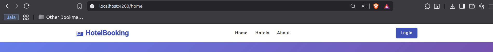
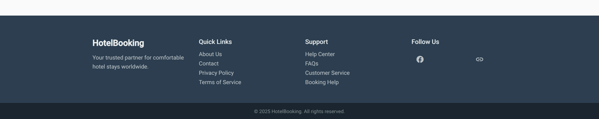
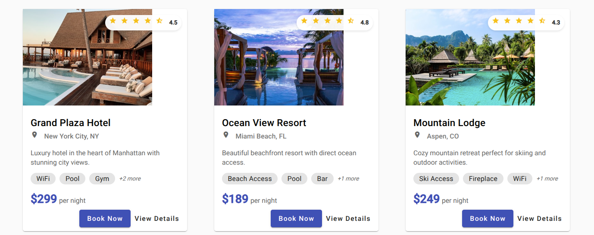
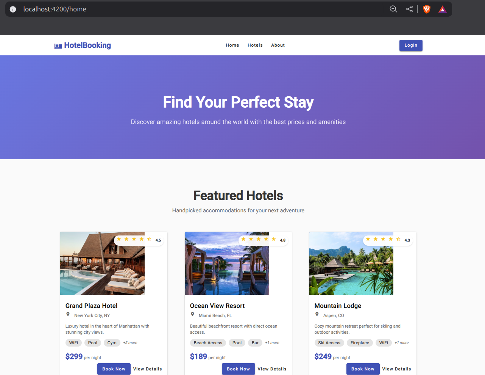
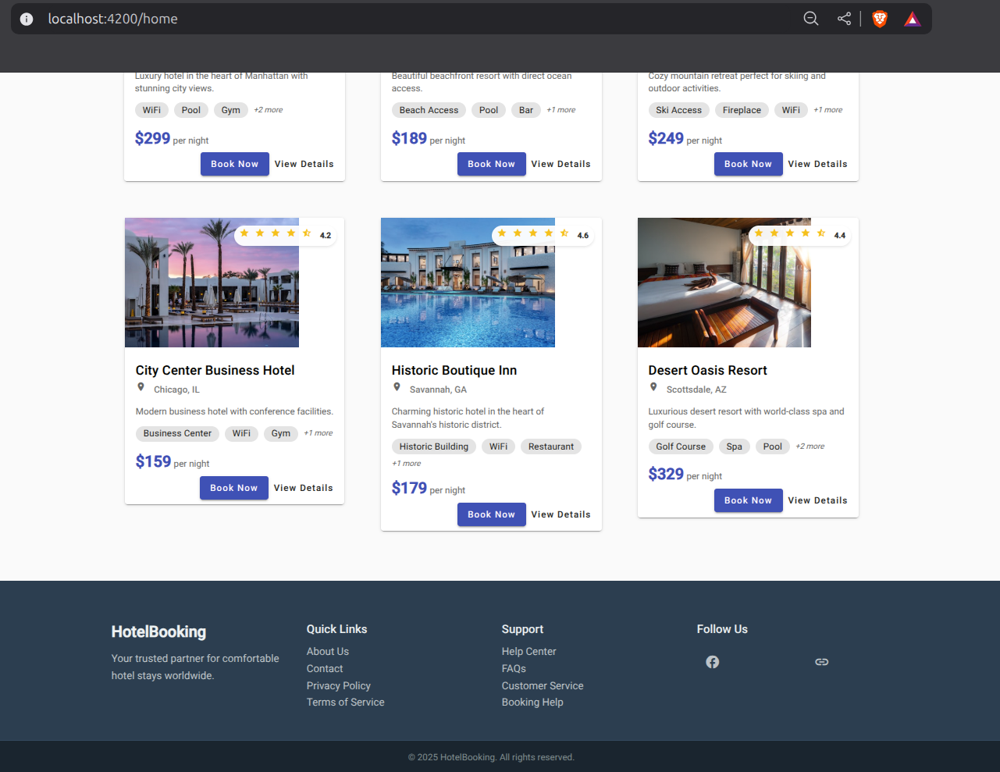

# Lab05-02: Angular Component Creation Implementation

## Overview
This document explains the implementation of Activity #2 - Component Creation for the hotel booking system using Angular v20 with Angular Material design components.

## Project Structure

The Angular application has been created with the following structure:

```
frontend/hotel-booking/
├── src/
│   ├── app/
│   │   ├── shared/
│   │   │   ├── header/         # Header component with navigation
│   │   │   ├── footer/         # Footer component with links
│   │   │   └── hotel-card/     # Reusable hotel card component
│   │   ├── pages/
│   │   │   └── home/           # Home page component
│   │   ├── app.ts              # Main app component
│   │   ├── app.html            # App template
│   │   ├── app.scss            # App styles
│   │   ├── app.config.ts       # App configuration
│   │   └── app.routes.ts       # Routing configuration
│   ├── styles.scss             # Global styles
│   └── index.html              # Main HTML file
├── angular.json                # Angular CLI configuration
├── package.json                # Dependencies
└── tsconfig.json              # TypeScript configuration
```

## Component Implementation Details

### 1. HeaderComponent

**Location**: `src/app/shared/header/`

**Features Implemented**:
- Logo with hotel icon and brand name
- Navigation links (Home, Hotels, About)
- Login/User authentication area with Material Design
- Responsive design that hides navigation on mobile

**Screen Capture**:


**Key Code Implementation**:
```typescript
@Component({
  selector: 'app-header',
  imports: [MatToolbarModule, MatButtonModule, MatIconModule, MatMenuModule, MatDividerModule],
  templateUrl: './header.html',
  styleUrl: './header.scss'
})
export class HeaderComponent {
  isLoggedIn = false;
  userName = 'Guest User';

  onLogin() {
    console.log('Login clicked');
  }

  onLogout() {
    console.log('Logout clicked');
  }
}
```

**Design Features**:
- Clean white background with Material Design elevation
- Professional blue color scheme (#3f51b5)
- Responsive layout with mobile-first approach
- Hover effects and smooth transitions
- Simplified interface focused on core navigation and authentication

### 2. FooterComponent

**Location**: `src/app/shared/footer/`

**Features Implemented**:
- Company information section
- Quick links (About Us, Contact, Privacy Policy, Terms)
- Support section (Help Center, FAQs, Customer Service)
- Social media links with Material icons
- Copyright information with current year
- Responsive grid layout

**Screen Capture**:


**Key Code Implementation**:
```typescript
@Component({
  selector: 'app-footer',
  imports: [MatIconModule, MatButtonModule],
  templateUrl: './footer.html',
  styleUrl: './footer.scss'
})
export class FooterComponent {
  currentYear = new Date().getFullYear();
  
  socialLinks = [
    { name: 'Facebook', icon: 'facebook', url: '#' },
    { name: 'Twitter', icon: 'twitter', url: '#' },
    { name: 'Instagram', icon: 'instagram', url: '#' },
    { name: 'LinkedIn', icon: 'linkedin', url: '#' }
  ];
}
```

**Design Features**:
- Dark theme with professional color scheme
- CSS Grid layout for responsive design
- Hover effects on links and social media buttons
- Clean typography and spacing

### 3. HotelCardComponent

**Location**: `src/app/shared/hotel-card/`

**Features Implemented**:
- Hotel image display with proper aspect ratio
- Rating system with star icons
- Hotel name and location with location icon
- Description with text truncation
- Amenities display with Material chips
- Price per night display
- Book Now and View Details buttons
- Hover animations and elevation effects

**Screen Capture**:


**Key Code Implementation**:
```typescript
export interface Hotel {
  id: number;
  name: string;
  location: string;
  rating: number;
  imageUrl: string;
  description?: string;
  pricePerNight: number;
  amenities: string[];
}

@Component({
  selector: 'app-hotel-card',
  imports: [MatCardModule, MatButtonModule, MatIconModule, MatChipsModule],
  templateUrl: './hotel-card.html',
  styleUrl: './hotel-card.scss'
})
export class HotelCardComponent {
  @Input() hotel!: Hotel;
  @Input() showBookButton: boolean = true;
  @Output() bookHotel = new EventEmitter<number>();

  getRatingStars(): string[] {
    // Logic to generate star icons based on rating
    const fullStars = Math.floor(this.hotel.rating);
    const hasHalfStar = this.hotel.rating % 1 !== 0;
    // ... star generation logic
  }
}
```

**Design Features**:
- Material Design card with elevation and shadows
- Responsive image handling with object-fit
- Smooth hover animations (translateY and shadow effects)
- Rating badge overlay on hotel images
- Professional pricing display

### 4. HomeComponent

**Location**: `src/app/pages/home/`

**Features Implemented**:
- Hero section with gradient background
- Featured hotels grid layout
- Mock hotel data integration
- Hotel booking event handling
- Responsive design for all screen sizes
- Empty state handling

**Screen Capture**:




**Key Code Implementation**:
```typescript
@Component({
  selector: 'app-home',
  imports: [CommonModule, MatGridListModule, MatButtonModule, MatIconModule, HotelCardComponent],
  templateUrl: './home.html',
  styleUrl: './home.scss'
})
export class HomeComponent implements OnInit {
  hotels: Hotel[] = [];

  ngOnInit() {
    this.loadMockHotels();
  }

  onHotelBooked(hotelId: number) {
    console.log(`Booking hotel with ID: ${hotelId}`);
  }

  private loadMockHotels() {
    // Mock data with 6 different hotels
    this.hotels = [/* ... hotel data ... */];
  }
}
```

**Design Features**:
- Attractive hero section with gradient background
- CSS Grid layout for responsive hotel cards
- Professional typography and spacing
- Mobile-optimized design

## Technical Implementation

### Angular Material Integration

The application uses Angular Material v20 with the following modules:
- `MatToolbarModule` - Header navigation
- `MatCardModule` - Hotel cards
- `MatButtonModule` - Interactive buttons
- `MatIconModule` - Icons throughout the app
- `MatMenuModule` - Dropdown menus
- `MatChipsModule` - Amenity tags

### Responsive Design

All components implement responsive design using:
- CSS Grid and Flexbox layouts
- Media queries for mobile optimization
- Mobile-first approach
- Proper spacing and typography scaling

### TypeScript Features

The application leverages modern TypeScript and Angular features:
- Standalone components (no NgModules)
- Signal-based reactivity
- Strongly typed interfaces
- Input/Output decorators for component communication
- Control flow syntax (@for, @if)

### SCSS Styling

Professional styling implemented with:
- Nested SCSS syntax
- CSS custom properties
- Smooth animations and transitions
- Material Design principles
- Consistent color schemes and typography

## Routing Configuration

The application includes basic routing setup:
```typescript
export const routes: Routes = [
  { path: '', redirectTo: '/home', pathMatch: 'full' },
  { path: 'home', component: HomeComponent },
  { path: '**', redirectTo: '/home' }
];
```

## Mock Data

The application includes comprehensive mock hotel data with:
- 6 different hotels with varied locations
- Realistic pricing and ratings
- High-quality Unsplash images
- Diverse amenities for each hotel
- Professional descriptions

## Key Features Delivered

✅ **Component Creation**: All components created using Angular CLI  
✅ **Header Design**: Professional header with logo, navigation, and user controls  
✅ **Footer Design**: Comprehensive footer with links and social media  
✅ **Hotel Cards**: Reusable card component with rich information display  
✅ **Home Page**: Complete landing page with hero section and hotel grid  
✅ **Angular Material**: Extensive use of Material Design components  
✅ **Responsive Design**: Mobile-first, responsive layout throughout  
✅ **TypeScript**: Strongly typed implementation with interfaces  
✅ **SCSS Styling**: Professional styling with animations and effects  

## Running the Application

To run the application:

1. Navigate to the project directory:
   ```bash
   cd frontend/hotel-booking
   ```

2. Install dependencies:
   ```bash
   npm install
   ```

3. Start the development server:
   ```bash
   npm start
   ```

4. Open browser to `http://localhost:4200`

The application provides a complete, professional hotel booking interface with all required components implemented according to the specifications, using Angular v20 and Angular Material for a modern, responsive user experience.
