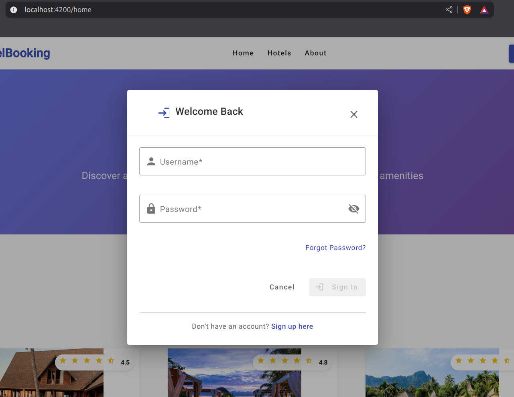
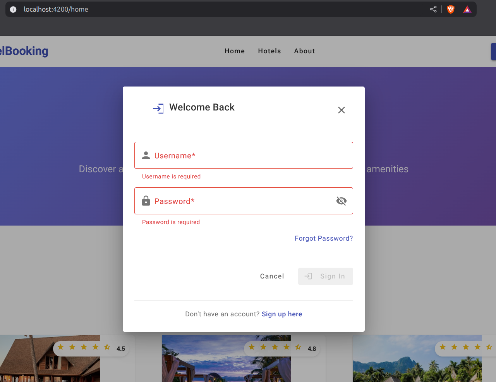

# Lab05-03: Login System Implementation

## Overview
This document explains the implementation of Activity #3 - Login System Implementation for the hotel booking system using Angular v20 with reactive forms and Material Design components.

## Implementation Details

### LoginComponent

**Location**: `src/app/shared/login/`

**Features Implemented**:
- Modal dialog login form
- Reactive form validation with Angular Forms
- Username and password fields with validation
- Password visibility toggle
- Real-time form validation with error messages
- Professional Material Design interface
- Responsive design for mobile devices

**Screenshots**:


### Key Components Created

#### 1. LoginComponent TypeScript Implementation

```typescript
@Component({
  selector: 'app-login',
  imports: [
    CommonModule,
    ReactiveFormsModule,
    MatDialogModule,
    MatFormFieldModule,
    MatInputModule,
    MatButtonModule,
    MatIconModule,
    MatCardModule
  ],
  templateUrl: './login.html',
  styleUrl: './login.scss'
})
export class LoginComponent {
  loginForm: FormGroup;
  hidePassword = true;

  constructor(
    private fb: FormBuilder,
    public dialogRef: MatDialogRef<LoginComponent>,
    @Inject(MAT_DIALOG_DATA) public data: any
  ) {
    this.loginForm = this.fb.group({
      username: ['', [Validators.required, Validators.minLength(3)]],
      password: ['', [Validators.required, Validators.minLength(6)]]
    });
  }
}
```

#### 2. Form Validation Rules

**Username Field**:
- Required field validation
- Minimum length: 3 characters
- Custom error messages

**Password Field**:
- Required field validation
- Minimum length: 6 characters
- Password visibility toggle functionality
- Custom error messages

**Screenshots**:


#### 3. Login Interface

```typescript
export interface LoginData {
  username: string;
  password: string;
}
```

### Form Validation Features

#### Validation Rules Implemented

1. **Required Field Validation**:
   - Both username and password are required
   - Error message: "Username is required" / "Password is required"

2. **Minimum Length Validation**:
   - Username: minimum 3 characters
   - Password: minimum 6 characters
   - Error message: "Username must be at least 3 characters"

3. **Real-time Validation**:
   - Validation errors appear when fields are touched
   - Submit button is disabled when form is invalid
   - Visual feedback with Material Design error styling

#### Error Handling Method

```typescript
getErrorMessage(fieldName: string): string {
  const field = this.loginForm.get(fieldName);
  
  if (field?.hasError('required')) {
    return `${fieldName.charAt(0).toUpperCase() + fieldName.slice(1)} is required`;
  }
  
  if (field?.hasError('minlength')) {
    const minLength = field.errors?.['minlength'].requiredLength;
    return `${fieldName.charAt(0).toUpperCase() + fieldName.slice(1)} must be at least ${minLength} characters`;
  }
  
  return '';
}
```

### Modal Dialog Integration

#### HeaderComponent Integration

The login modal is triggered from the HeaderComponent when the Login button is clicked:

```typescript
onLogin() {
  const dialogRef = this.dialog.open(LoginComponent, {
    width: '500px',
    maxWidth: '90vw',
    disableClose: false,
    panelClass: 'login-dialog'
  });

  dialogRef.afterClosed().subscribe(result => {
    if (result?.success) {
      const loginData: LoginData = result.data;
      this.isLoggedIn = true;
      this.userName = loginData.username;
      console.log('User logged in:', loginData);
    }
  });
}
```

#### Dialog Configuration

- **Width**: 500px (responsive on mobile)
- **Max Width**: 90% of viewport width
- **Close Behavior**: Allows closing by clicking outside or ESC key
- **Custom Styling**: Applied via `login-dialog` CSS class

### User Interface Features

#### Login Modal Design

1. **Header Section**:
   - Welcome message with login icon
   - Close button (X) in top-right corner
   - Clean separator line

2. **Form Section**:
   - Username field with person icon prefix
   - Password field with lock icon prefix and visibility toggle
   - Forgot password link
   - Form validation error messages

3. **Action Section**:
   - Cancel button (closes modal)
   - Sign In button (submits form, disabled when invalid)
   - Submit button includes login icon

4. **Footer Section**:
   - Sign up link for new users
   - Clean separator line

#### Responsive Design Features

- Mobile-optimized layout (320px minimum width)
- Responsive margins and padding
- Touch-friendly button sizes
- Accessible form labels and ARIA attributes

### Styling Implementation

#### SCSS Features

```scss
.login-modal {
  min-width: 400px;
  max-width: 500px;
  width: 100%;
  
  @media (max-width: 600px) {
    min-width: 320px;
    margin: 16px;
  }
}
```

#### Material Design Integration

- Outline form field appearance
- Primary color scheme (#3f51b5)
- Material Design elevation and shadows
- Consistent spacing and typography
- Hover effects and transitions

### Form Functionality

#### Submit Behavior

1. **Valid Form Submission**:
   - Logs login attempt to console
   - Closes modal with success result
   - Updates header to show logged-in state
   - Displays username in user menu

2. **Invalid Form Submission**:
   - Marks all fields as touched to show validation errors
   - Prevents form submission
   - Keeps modal open for corrections

#### Password Visibility Toggle

```typescript
togglePasswordVisibility() {
  this.hidePassword = !this.hidePassword;
}
```

- Eye icon changes between `visibility` and `visibility_off`
- Input type toggles between `password` and `text`
- Accessible with proper ARIA attributes

### Integration Points

#### HeaderComponent Changes

1. **MatDialog Integration**:
   - Imported MatDialog service
   - Added LoginComponent import
   - Configured dialog opening logic

2. **State Management**:
   - `isLoggedIn` boolean flag
   - `userName` string for display
   - Login/logout state transitions

#### Global Styling Updates

Added login dialog specific styles to `styles.scss`:

```scss
.login-dialog {
  .mat-mdc-dialog-container {
    border-radius: 12px;
    box-shadow: 0 8px 24px rgba(0,0,0,0.15);
  }
}
```

## Key Features Delivered

✅ **LoginComponent Creation**: Modal dialog component with proper structure  
✅ **Form Validation**: Reactive forms with field validation rules  
✅ **Error Messages**: Custom error messages for validation failures  
✅ **Password Toggle**: Visibility toggle for password field  
✅ **Material Design**: Professional UI with Material Design components  
✅ **Responsive Design**: Mobile-optimized layout and interactions  
✅ **Header Integration**: Modal opens when Login button is clicked  
✅ **State Management**: Login/logout state handling in header  
✅ **TypeScript**: Strongly typed implementation with interfaces  

## Form Validation Rules Summary

| Field | Required | Min Length | Error Messages |
|-------|----------|------------|----------------|
| Username | ✅ | 3 chars | "Username is required", "Username must be at least 3 characters" |
| Password | ✅ | 6 chars | "Password is required", "Password must be at least 6 characters" |

## User Experience Flow

1. User clicks "Login" button in header
2. Login modal opens with form fields
3. User enters username and password
4. Real-time validation provides feedback
5. Submit button enables when form is valid
6. Successful submission updates header state
7. Modal closes and user sees logged-in interface

The implementation provides a complete, professional login system with comprehensive form validation, error handling, and user experience design following Angular and Material Design best practices.
