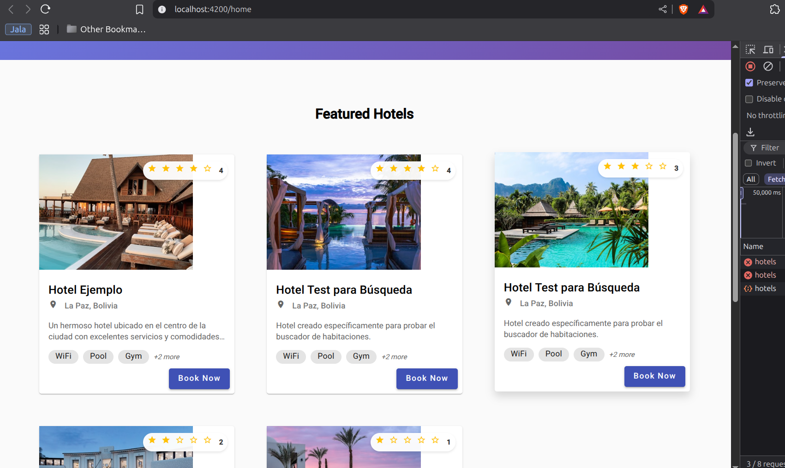
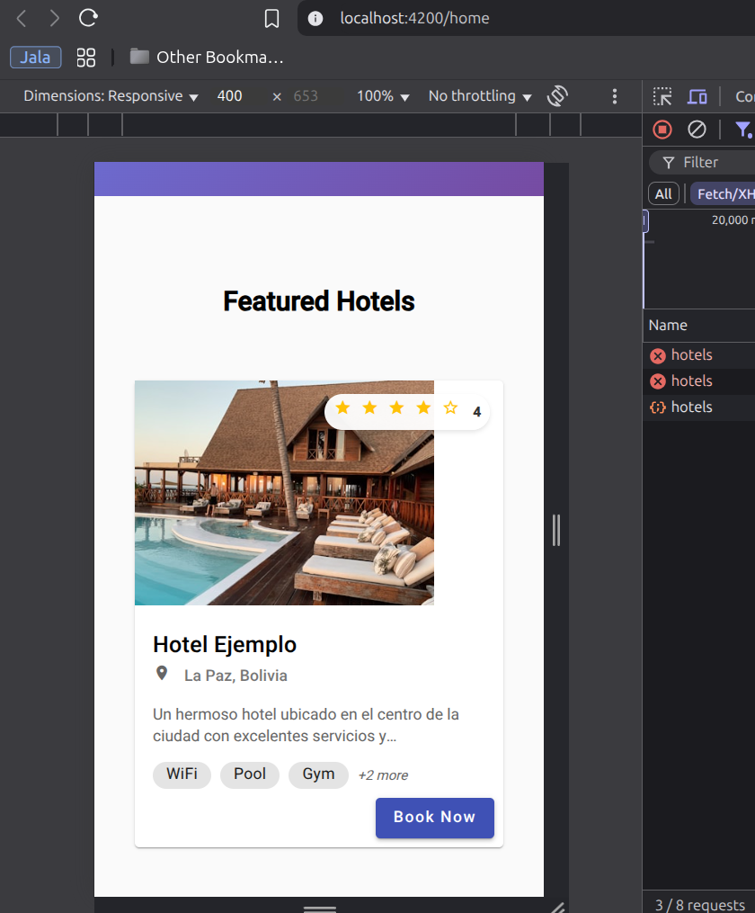
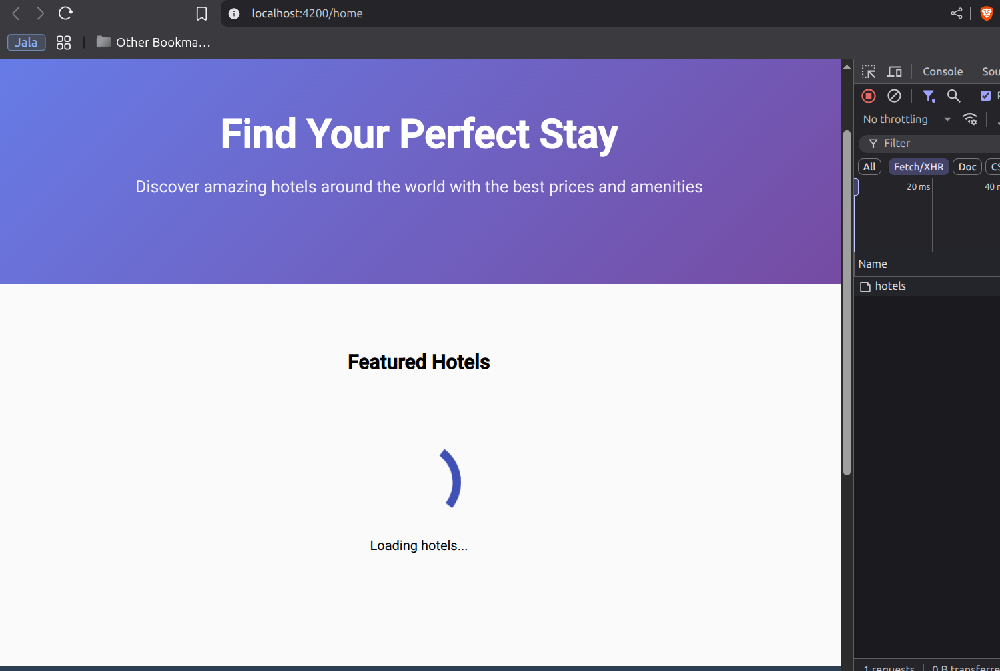
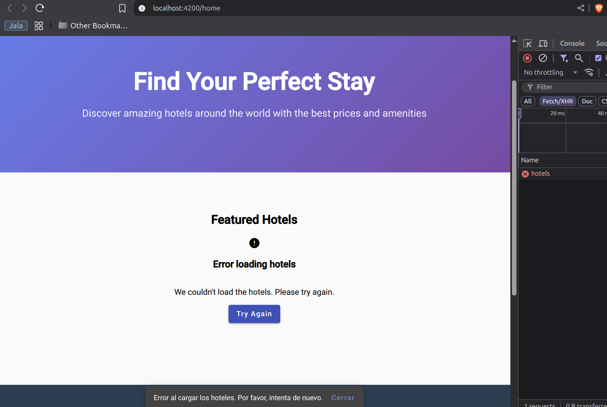

# Lab06 - Actividad #1: Consumo de API - Mostrar Opciones de Hoteles Disponibles

## Descripción
Integración de la API para obtener la lista de hoteles disponibles y mostrarlos en la interfaz de usuario mediante un componente dedicado.

## Implementación Realizada

### 1. Servicio Angular para Peticiones API
Se creó el servicio `HomeService` en `pages/home/services/home.service.ts` con:
- State management reactivo usando BehaviorSubject
- Observables para hotels$, isLoading$, error$
- Manejo de errores robusto
- Patrón de union types para estados

### 2. Componente de Lista de Hoteles
Se actualizó `HomeComponent` para:
- Consumir el servicio de hoteles
- Mostrar loading states
- Manejar errores con snackbar
- Implementar refresh functionality

### 3. Componente Hotel Card Actualizado
Se modificó `HotelCardComponent` para trabajar con la nueva estructura de datos:
- Interface `Hotel` actualizada según API response
- Campos mostrados: nombre, ubicación, rating, descripción, amenidades
- Manejo de imágenes con fallback
- Rating con estrellas visuales

### 4. Manejo de Errores
- Error boundaries en el servicio
- UI feedback con Material Snackbar
- Estados de loading y error en templates
- Botón "Try Again" para recuperación

## Estructura de Datos API

La API retorna hoteles con la siguiente estructura:
```json
{
  "success": true,
  "message": "Hoteles obtenidos exitosamente",
  "data": [
    {
      "id": "687bb53a8a654f8b47dd201b",
      "name": "Hotel Ejemplo",
      "description": "Un hermoso hotel...",
      "address": {
        "city": "La Paz",
        "country": "Bolivia"
      },
      "rating": {
        "average": 4.5,
        "totalReviews": 10
      },
      "amenities": ["WiFi", "Pool", "Gym"]
    }
  ]
}
```

## Screenshots

### 1. Página Principal con Hoteles Cargados


*Vista principal mostrando la lista de hoteles obtenidos desde la API con el hero section y grid de hoteles.*

### 2. Vista Detallada de Hotel Cards


*Detalle de las tarjetas de hoteles mostrando información completa: nombre, ubicación, rating con estrellas, amenidades y botón de reserva.*

### 3. Estado de Loading


*Durante la carga de datos desde la API, se muestra un spinner de Material Design con mensaje informativo.*

### 4. Manejo de Errores


*En caso de error en la API, se muestra un mensaje de error con opción de reintentar la carga.*

## Características Implementadas

✅ **Servicio específico por página** con state management reactivo  
✅ **Componentes actualizados** para nueva API  
✅ **Datos mostrados**: nombre, ubicación, rating, descripción, amenidades  
✅ **Manejo robusto de errores** con recuperación  
✅ **Arquitectura escalable** siguiendo patrones de las lecciones  

## Patrones Aplicados (Transcripts de Diego Garcia)
- **Union Types**: Estados discriminados (idle, loading, success, error)
- **BehaviorSubject**: State management reactivo
- **Lifecycle Management**: ngOnDestroy() con cleanup
- **Provider Strategy**: Servicios locales por página
- **Observable Filtering**: filter() y map() para narrowing

## Diferencias con Versión Anterior
1. **Estructura**: `shared/services/hotel.service.ts` → `pages/home/services/home.service.ts`
2. **Nombre**: `HotelService` → `HomeService`
3. **Provider**: Global → Local en componente
4. **Arquitectura**: Patrón "servicios por página"

## Tecnologías Utilizadas
- Angular 20
- Angular Material
- RxJS para reactive programming
- HttpClient para peticiones HTTP
- TypeScript con tipos estrictos

## Próximos Pasos
- Configurar Node.js v22 correctamente
- Probar integración completa con backend
- Seguir patrón para futuras páginas (search, bookings, etc.)
- Implementar filtros y búsqueda avanzada
