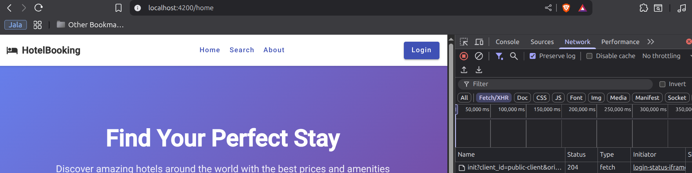

# Lab06 - Actividad #2: Consumo de API - Autenticación de Usuarios

## Descripción
Implementación de funcionalidad de inicio de sesión utilizando Keycloak para autenticar usuarios.

## Implementación Realizada

### 1. Configuración de Keycloak en Angular
Se configuró Keycloak en `app.config.ts` utilizando `provideKeycloak`:
- **URL del servidor**: `http://localhost:8080/`
- **Realm**: `hotel-booking`
- **Client ID**: `public-client`
- **Modo de carga**: `check-sso` (verificación silenciosa)

### 2. Archivo de Verificación Silenciosa
Se creó `public/silent-check-sso.html` requerido por Keycloak para:
- Evitar redirecciones completas al servidor de Keycloak
- Realizar autenticación en iframe oculto
- Mejorar experiencia de usuario

### 3. Componente Header con Autenticación
El `HeaderComponent` fue modificado para integrar con Keycloak:
- **Inyección de dependencia**: `inject(Keycloak)` siguiendo patrones del profesor
- **Estado de autenticación**: `keycloak.authenticated`
- **Información del usuario**: `keycloak.tokenParsed?.preferred_username`
- **Métodos de autenticación**:
  - `onLogin()`: Redirige a página de login de Keycloak
  - `onLogout()`: Cierra sesión en Keycloak

### 4. Interfaz de Usuario Dinámica
El header cambia dinámicamente según el estado de autenticación:
- **No autenticado**: Muestra botón "Login"
- **Autenticado**: Muestra menú de usuario con nombre y opción "Logout"

### 5. Eliminación del Componente Login
Se eliminó el uso del componente `LoginComponent` ya que:
- La autenticación se maneja completamente por Keycloak
- No se requiere formulario personalizado
- Keycloak proporciona su propia página de login

## Flujo de Autenticación

### Inicio de Sesión Exitoso:
1. Usuario hace clic en "Login" del header
2. Redirección a página de login de Keycloak
3. Usuario ingresa credenciales en Keycloak
4. Keycloak valida credenciales
5. Redirección automática a la aplicación
6. Header muestra menú de usuario

### Error de Autenticación:
1. Usuario hace clic en "Login"
2. Redirección a Keycloak
3. Credenciales inválidas
4. Keycloak muestra mensaje de error
5. Usuario permanece en página de login

## Código Implementado

### Configuración Principal (app.config.ts)
```typescript
provideKeycloak({
  config: {
    url: 'http://localhost:8080/',
    realm: 'hotel-booking',
    clientId: 'public-client'
  },
  initOptions: {
    onLoad: 'check-sso',
    silentCheckSsoRedirectUri: window.location.origin + '/silent-check-sso.html'
  }
})
```

### Header Component (header.ts)
```typescript
export class HeaderComponent implements OnInit {
  private keycloak = inject(Keycloak);
  
  isLoggedIn = false;
  userName = '';

  ngOnInit() {
    this.isLoggedIn = this.keycloak.authenticated || false;
    if (this.isLoggedIn) {
      this.userName = this.keycloak.tokenParsed?.preferred_username || 'Usuario';
    }
  }

  onLogin() {
    this.keycloak.login();
  }

  onLogout() {
    this.keycloak.logout();
  }
}
```

## Screenshots

### 1. Header con Botón Login (Usuario No Autenticado)


*Header de la aplicación mostrando el botón "Login" cuando el usuario no está autenticado. El botón está destacado en color primary para llamar la atención.*

### 2. Redirección a Keycloak


*Página de login de Keycloak donde el usuario ingresa sus credenciales. La interfaz es proporcionada completamente por Keycloak.*

### 3. Header con Usuario Autenticado


*Header mostrando el menú de usuario después de la autenticación exitosa. Se puede ver el ícono de usuario y el menú desplegable con el nombre del usuario.*

### 4. Proceso de Logout


*Confirmación del proceso de logout donde Keycloak cierra la sesión tanto en la aplicación como en el servidor de autenticación.*
