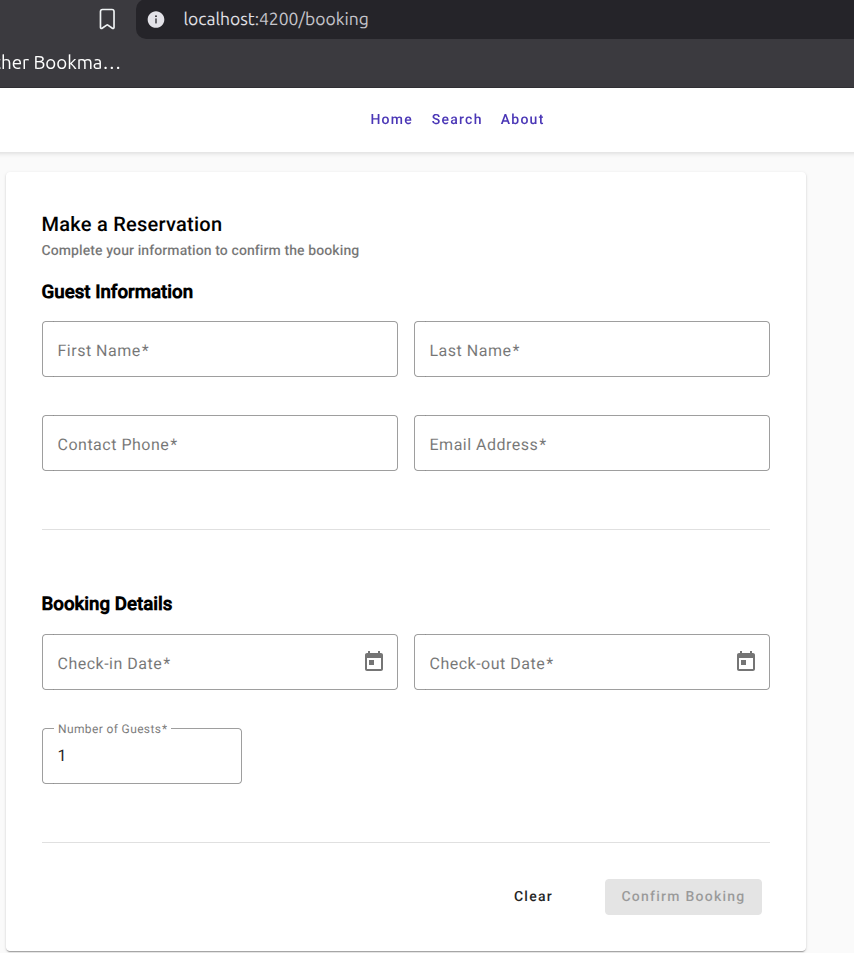
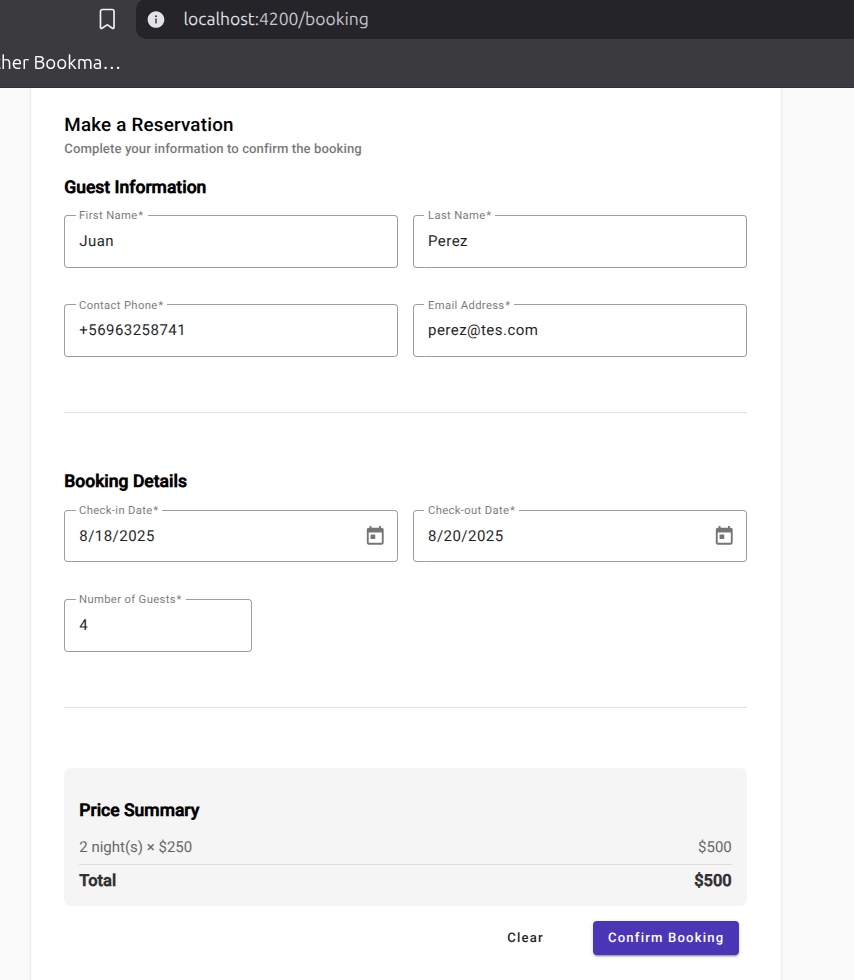
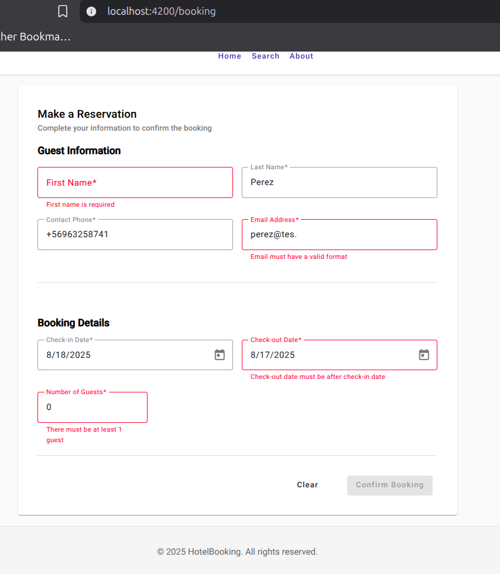
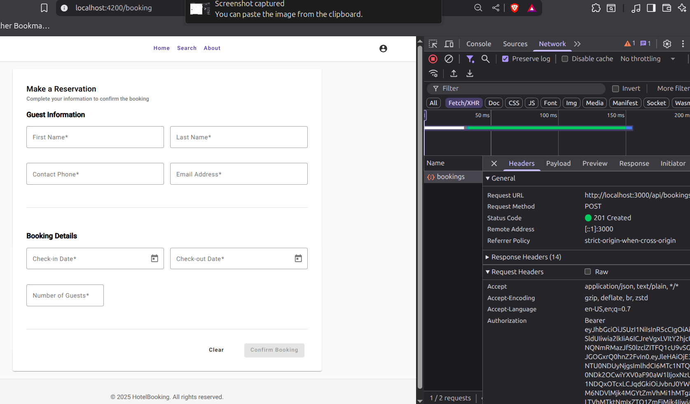
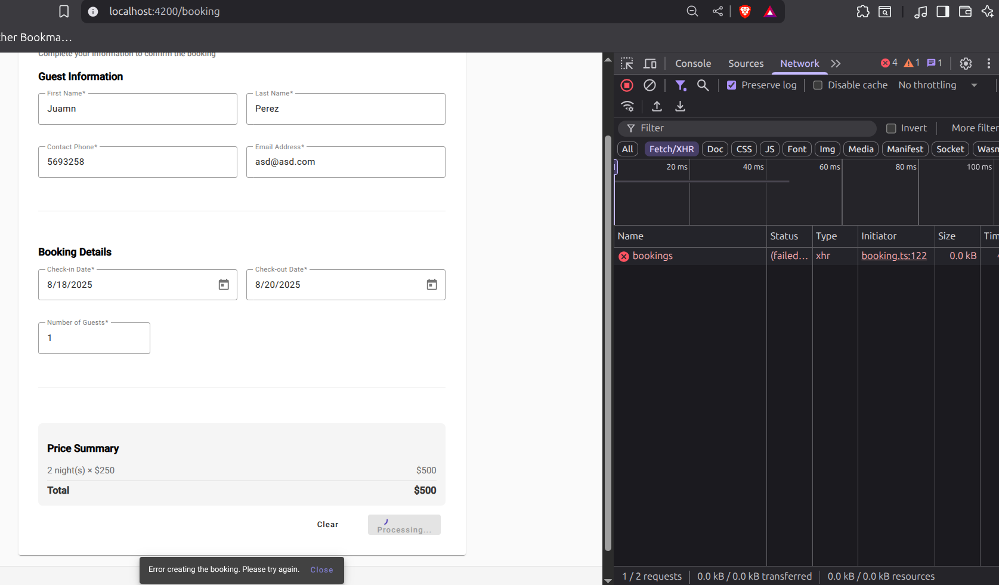

# Lab06 - Actividad #3: Creación del Componente de Reservas

## Descripción
Implementación completa de un sistema de reservas que permite a los usuarios realizar reservas de habitaciones, incluyendo tanto el backend como el frontend.

## Implementación Realizada

### Backend (API)

#### 1. Modelo de Datos
Se creó una nueva colección `bookings` en MongoDB con los siguientes campos:
- **hotelId**: Referencia al hotel
- **roomTypeId**: Referencia al tipo de habitación
- **guestName**: Nombre del huésped
- **guestLastName**: Apellido del huésped
- **guestPhone**: Teléfono de contacto
- **guestEmail**: Correo electrónico
- **checkInDate**: Fecha de entrada
- **checkOutDate**: Fecha de salida
- **numberOfGuests**: Número de huéspedes
- **totalAmount**: Monto total
- **status**: Estado (pending, confirmed, cancelled)

#### 2. Arquitectura Implementada
Siguiendo los patrones del proyecto:
- **Entidad de Dominio**: `Booking.js` con validaciones de negocio
- **Repositorio Abstracto**: `BookingRepository.js`
- **Implementación MongoDB**: `MongoBookingRepository.js`
- **Casos de Uso**: `BookingUseCases.js` con lógica de negocio
- **Validadores**: `bookingValidators.js` con validaciones Joi
- **Controlador**: `bookingController.js` para manejo HTTP
- **Rutas**: `bookingRoutes.js` con endpoints RESTful

#### 3. Endpoints Implementados
```
POST   /api/bookings              - Crear reserva (protegido)
GET    /api/bookings              - Listar reservas (protegido)
GET    /api/bookings/:id          - Obtener reserva (protegido)
GET    /api/bookings/guest/:email - Reservas por email (protegido)
DELETE /api/bookings/:id          - Eliminar reserva (protegido)
```

#### 4. Validaciones de Negocio
- Fechas válidas (check-out > check-in)
- Capacidad de huéspedes vs. habitación
- Formato de email y teléfono

### Frontend (Angular)

#### 1. Componente de Reservas
**Ubicación**: `src/app/shared/booking/`

**Características**:
- Formulario reactivo con validaciones
- Campos requeridos según especificaciones
- Validación en tiempo real
- Cálculo automático de precios
- Feedback visual para errores

#### 2. Campos del Formulario
- **Nombre del usuario** (requerido, 2-100 caracteres)
- **Apellido** (requerido, 2-100 caracteres)
- **Teléfono de contacto** (requerido, formato válido)
- **Correo electrónico** (requerido, formato email válido)
- **Fecha de entrada** (requerida, no en el pasado)
- **Fecha de salida** (requerida, posterior a entrada)
- **Número de huéspedes** (requerido, 1-20)

#### 3. Validaciones Frontend
```typescript
guestName: [Validators.required, Validators.minLength(2), Validators.maxLength(100)]
guestEmail: [Validators.required, Validators.email]
checkOutDate: [Custom validator para fechas]
```

#### 4. Servicio de API
**BookingService** con métodos para:
- `createBooking()`: Crear nueva reserva

## Flujo Completo de Reserva

### 1. Usuario Completa Formulario
- Ingresa datos personales
- Selecciona fechas
- Especifica número de huéspedes
- Ve cálculo automático del precio total

### 2. Validación Frontend
- Validación en tiempo real de campos
- Verificación de fechas válidas
- Formato correcto de email y teléfono

### 3. Envío a API
- POST a `/api/bookings`
- Validación backend con Joi
- Verificación de hotel y room type existentes
- Validación de capacidad de huéspedes

### 4. Respuesta y Feedback
- **Éxito**: Mensaje de confirmación, formulario se limpia
- **Error**: Mensaje de error específico

## Screenshots

### 1. Formulario de Reserva Vacío (Estado Inicial)


*Vista inicial del formulario de reservas mostrando todos los campos requeridos: Guest Information (First Name, Last Name, Contact Phone, Email Address) y Booking Details (Check-in Date, Check-out Date, Number of Guests).*

### 2. Formulario de Reserva Completado


*Formulario completamente lleno con datos de ejemplo mostrando la validación en tiempo real y el cálculo automático del precio total basado en las fechas seleccionadas.*

### 3. Validaciones de Campos en Tiempo Real


*Demostración de las validaciones frontend en acción: campos requeridos marcados en rojo, mensajes de error específicos para formato de email, teléfono y validación de fechas.*

### 6. Mensaje de Confirmación de Reserva Exitosa


*Snackbar de Angular Material mostrando el mensaje "Booking created successfully! We will contact you soon." después de crear una reserva exitosamente.*

### 8. Manejo de Errores de API


*Mensaje de error mostrado cuando falla la creación de la reserva: "Error creating the booking. Please try again." con opción de reintentar.*

## Peticiones cURL para Pruebas

### Crear Reserva
```bash
curl --location 'http://localhost:3000/api/bookings' \
--header 'Content-Type: application/json' \
--data '{
  "hotelId": "687bb53a8a654f8b47dd201b",
  "roomTypeId": "687bb53a8a654f8b47dd201c",
  "guestName": "Juan",
  "guestLastName": "Pérez",
  "guestPhone": "+591-70123456",
  "guestEmail": "juan.perez@example.com",
  "checkInDate": "2025-09-01",
  "checkOutDate": "2025-09-05",
  "numberOfGuests": 2,
  "totalAmount": 400.00
}'
```

### Respuesta Exitosa
```json
{
  "success": true,
  "message": "Reserva creada exitosamente",
  "data": {
    "id": "66f8a1b2c3d4e5f6a7b8c9d0",
    "hotelId": "687bb53a8a654f8b47dd201b",
    "roomTypeId": "687bb53a8a654f8b47dd201c",
    "guestName": "Juan",
    "guestLastName": "Pérez",
    "guestPhone": "+591-70123456",
    "guestEmail": "juan.perez@example.com",
    "checkInDate": "2025-09-01T00:00:00.000Z",
    "checkOutDate": "2025-09-05T00:00:00.000Z",
    "numberOfGuests": 2,
    "totalAmount": 400,
    "status": "pending",
    "createdAt": "2025-08-17T10:30:00.000Z"
  }
}
```

## Estructura de Archivos Creados

### Backend
```
backend/src/
├── domain/entities/Booking.js
├── domain/repositories/BookingRepository.js
├── domain/usecases/BookingUseCases.js
├── infrastructure/database/models/Booking.js
├── infrastructure/repositories/MongoBookingRepository.js
├── interfaces/controllers/bookingController.js
├── interfaces/routes/bookingRoutes.js
├── shared/validators/bookingValidators.js
└── tests/booking-endpoints-test.js
```

### Frontend
```
frontend/src/app/
├── shared/models/booking.ts
├── shared/booking/booking.ts
├── shared/booking/booking.html
├── shared/booking/booking.scss
└── shared/booking/services/booking.service.ts
```

## Notas de Implementación
Se utilizan valores por defecto en booking.ts debido a que dentro del flujo primero se debe buscar una pieza utilizando el endpoint de busqueda implementado en el back y luego de que el usuario escoja la habitacion ya tendriamos los datos necesarios para el componente booking.