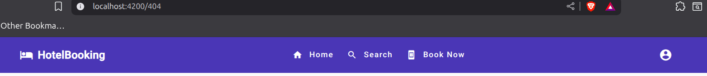
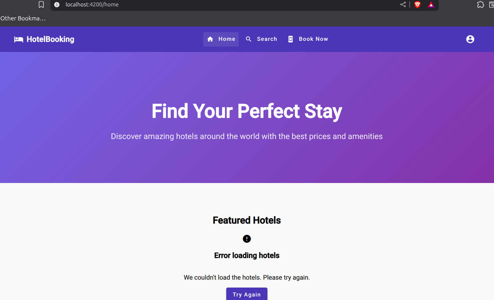
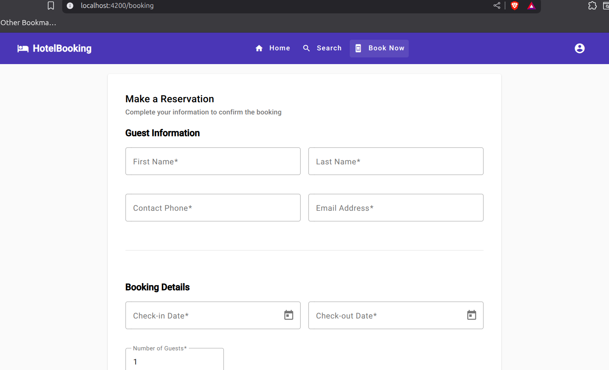
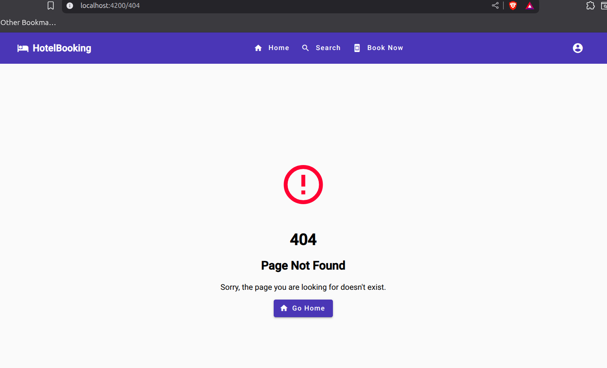
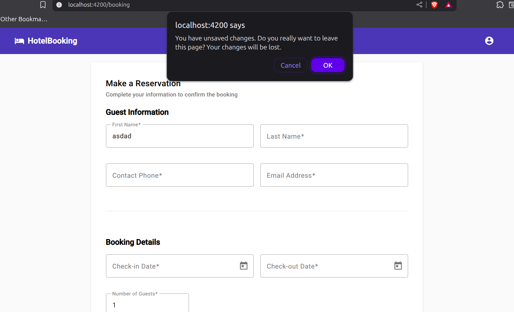

# Lab06 - Actividad #4: Configuración del Sistema de Routing

## Descripción
Configuración del sistema de routing para gestionar las diferentes páginas de la aplicación, incluyendo navegación funcional, manejo de errores 404 y guards para formularios sin guardar.

## Implementación Realizada

### 1. Configuración de Rutas (app.routes.ts)
Se implementó un sistema de routing completo con las siguientes rutas:

```typescript
export const routes: Routes = [
  // Ruta principal - página de inicio
  { path: '', component: HomeComponent },
  { path: 'home', component: HomeComponent },
  
  // Ruta de reservas - con guard para cambios sin guardar
  {
    path: 'booking',
    loadComponent: () => import('./pages/booking/booking').then(m => m.BookingPageComponent),
    canDeactivate: [unsavedChangesGuard]
  },
  {
    path: '404',
    loadComponent: () => import('./pages/not-found/not-found').then(m => m.NotFoundComponent)
  },
  
  // Redirección a 404 para cualquier ruta no encontrada
  { path: '**', redirectTo: '/404' }
];
```

### 2. Guard para Formularios Sin Guardar
Se implementó `unsavedChangesGuard` para prevenir la navegación cuando hay datos sin guardar:

#### Interfaz CanDeactivateComponent
```typescript
export interface CanDeactivateComponent {
  canDeactivate?: () => Observable<boolean> | Promise<boolean> | boolean;
  hasUnsavedChanges?: () => boolean;
}
```

#### Implementación del Guard
```typescript
export const unsavedChangesGuard: CanDeactivateFn<CanDeactivateComponent> = (component) => {
  if (component.hasUnsavedChanges && component.hasUnsavedChanges()) {
    return confirm(
      'You have unsaved changes. Do you really want to leave this page? Your changes will be lost.'
    );
  }
  return true;
};
```

### 3. Navegación en Header
Se actualizó el HeaderComponent para incluir enlaces de navegación:

```html
<div class="navigation">
  <button mat-button routerLink="/home" routerLinkActive="active">
    <mat-icon>home</mat-icon>
    Home
  </button>
  <button mat-button routerLink="/search" routerLinkActive="active">
    <mat-icon>search</mat-icon>
    Search
  </button>
  <button mat-button routerLink="/booking" routerLinkActive="active">
    <mat-icon>book_online</mat-icon>
    Book Now
  </button>
</div>
```

### 4. Páginas Implementadas

#### HomeComponent (`/` y `/home`)
- Página principal con lista de hoteles
- Carga de datos desde la API
- Estados de loading y error
- Grid responsive de hotel cards

#### BookingComponent (`/booking`)
- Página wrapper para el componente de reservas
- Implementa `CanDeactivateComponent`
- Guard activo para prevenir pérdida de datos

#### NotFoundComponent (`/404`)
- Página de error 404 profesional
- Navegación de regreso a home y search
- Manejo de rutas inexistentes

### 5. Características del Sistema de Routing

#### Lazy Loading
- Todas las páginas (excepto Home) usan lazy loading
- Mejora el rendimiento de carga inicial
- Carga bajo demanda de componentes

#### Router Guards
- `unsavedChangesGuard` en rutas con formularios
- Confirmación antes de abandonar páginas con datos
- Prevención de pérdida accidental de información

## Flujo de Navegación Implementado

### Navegación Principal
1. **Home** (`/`) → Lista de hoteles disponibles
3. **Book Now** (`/booking`) → Formulario de reserva

### Navegación Secundaria
- **404 Page** (`/404`) → Para rutas no `válidas`
- **Logo click** → Regreso a home

### Guard de Formularios
- **Formulario de reserva** → Confirmación si hay datos
- **Después de submit exitoso** → Navegación libre

## Screenshots

### 1. Navegación Principal - Header


*Header mostrando la navegación principal con enlaces a Home, Search y Book Now. Los enlaces activos se destacan visualmente con el estado routerLinkActive.*

### 2. Página Home con Navegación


*Página principal mostrando la lista de hoteles con navegación completa. El enlace "Home" está activo en el header.*

### 4. Página de Reservas


*Página de reservas mostrando el formulario completo. El enlace "Book Now" está activo y el formulario tiene el guard implementado.*

### 7. Página 404 - Error


*Página de error 404 profesional con navegación de regreso a Home y Search. Se muestra cuando se accede a rutas inexistentes.*

### 8. Guard de Formularios - Confirmación


*Diálogo de confirmación del guard cuando el usuario intenta navegar con datos sin guardar en el formulario.*

## Características Implementadas

### Routing
- **Lazy loading** para optimización de rendimiento
- **Redirección automática** para rutas no válidas

### Navegación Funcional
- **Enlaces en header** con estados activos
- **Logo clickeable** que lleva a home

### Manejo de Errores
- **Página 404** profesional y útil
- **Rutas wildcard** para capturar errores

### Guards de Protección
- **Formularios sin guardar** protegidos

## Implementación del Guard en Componentes

### BookingComponent
```typescript
export class BookingComponent implements CanDeactivateComponent {
  hasUnsavedChanges(): boolean {
    const formValues = this.bookingForm.value;
    return !!(
      formValues.guestName?.trim() ||
      formValues.guestLastName?.trim() ||
      formValues.guestPhone?.trim() ||
      formValues.guestEmail?.trim() ||
      formValues.checkInDate ||
      formValues.checkOutDate ||
      (formValues.numberOfGuests && formValues.numberOfGuests !== 1)
    );
  }

  canDeactivate(): boolean {
    return !this.hasUnsavedChanges();
  }
}
```
