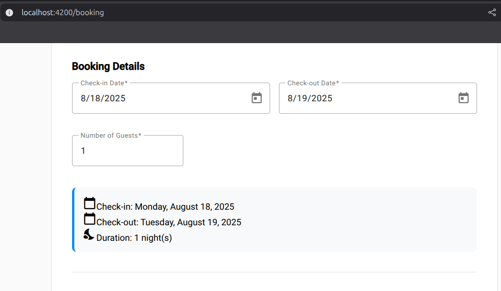
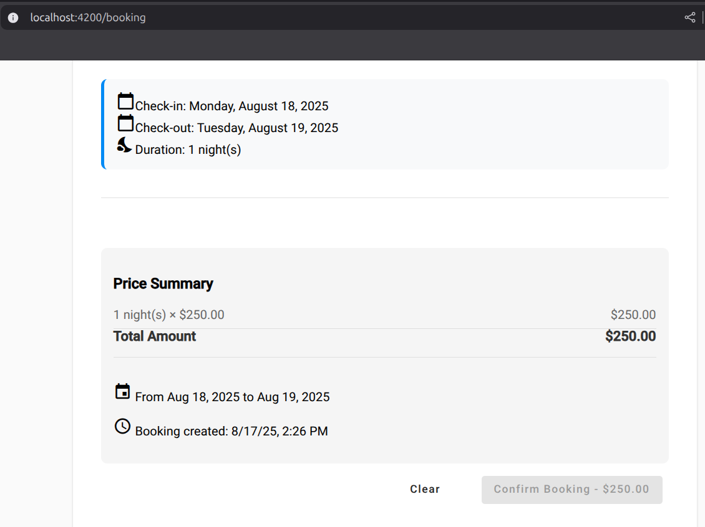

# Lab06 - Actividad #5: Uso de Pipes para Formatear Datos

## Descripción
Implementación de Angular Pipes para formatear fechas, monedas y otros datos mostrados en la interfaz del componente de reservas.

## Implementación Realizada

### 1. Pipes de Currency (Moneda)
Se implementaron pipes de currency en formato USD para mostrar precios formateados:

```html
<!-- Precio por noche -->
{{ pricePerNight | currency:'USD':'symbol':'1.2-2' }}

<!-- Total del cálculo -->
{{ getTotalAmount() | currency:'USD':'symbol':'1.2-2' }}

<!-- En el botón de confirmación -->
Confirm Booking - {{ getTotalAmount() | currency:'USD':'symbol':'1.2-2' }}
```

**Características del Currency Pipe:**
- **Formato**: `currency:'USD':'symbol':'1.2-2'`
- **Moneda**: USD (Dólares americanos)
- **Símbolo**: $ (símbolo de dólar)
- **Decimales**: 1 mínimo, 2 máximo (1.2-2)

### 2. Pipes de Date (Fechas)
Se implementaron varios formatos de date pipes para mostrar fechas de manera user-friendly:

```html
<!-- Fecha completa -->
{{ bookingForm.get('checkInDate')?.value | date:'fullDate' }}
<!-- Resultado: "Monday, August 17, 2025" -->

<!-- Fecha corta -->
{{ bookingForm.get('checkInDate')?.value | date:'MMM d, y' }}
<!-- Resultado: "Aug 17, 2025" -->

<!-- Fecha y hora corta -->
{{ currentDate | date:'short' }}
<!-- Resultado: "8/17/25, 3:45 PM" -->
```

**Tipos de Date Pipes Implementados:**
- **`fullDate`**: Formato completo con día de la semana
- **`MMM d, y`**: Formato abreviado para resumen
- **`short`**: Fecha y hora corta para timestamps

### 3. Ubicaciones de Implementación

#### En el Formulario de Reservas:
1. **Sección de Fechas Formateadas**:
   - Check-in y check-out con formato `fullDate`
   - Duración de la estadía calculada

2. **Resumen de Precios**:
   - Precio por noche formateado en USD
   - Total calculado con currency pipe
   - Información adicional de fechas en formato corto

3. **Botón de Confirmación**:
   - Precio total mostrado en el botón de acción

4. **Información de Reserva**:
   - Fechas en formato resumido (MMM d, y)
   - Timestamp de creación con formato corto

## Código Implementado

### Template HTML con Pipes
```html
<!-- Sección de Display de Fechas -->
<div class="date-display">
  <div class="date-info">
    <mat-icon>calendar_today</mat-icon>
    <span>Check-in: {{ bookingForm.get('checkInDate')?.value | date:'fullDate' }}</span>
  </div>
  <div class="date-info">
    <mat-icon>calendar_today</mat-icon>
    <span>Check-out: {{ bookingForm.get('checkOutDate')?.value | date:'fullDate' }}</span>
  </div>
  <div class="date-info">
    <mat-icon>nights_stay</mat-icon>
    <span>Duration: {{ getNights() }} night(s)</span>
  </div>
</div>

<!-- Resumen de Precios con Currency Pipe -->
<div class="price-summary">
  <h3>Price Summary</h3>
  <div class="price-row">
    <span>{{ getNights() }} night(s) × {{ pricePerNight | currency:'USD':'symbol':'1.2-2' }}</span>
    <span>{{ pricePerNight * getNights() | currency:'USD':'symbol':'1.2-2' }}</span>
  </div>
  <div class="price-total">
    <span>Total Amount</span>
    <span>{{ getTotalAmount() | currency:'USD':'symbol':'1.2-2' }}</span>
  </div>
  
  <!-- Información Adicional con Pipes -->
  <div class="booking-summary">
    <p class="booking-dates">
      <mat-icon>event</mat-icon>
      From {{ bookingForm.get('checkInDate')?.value | date:'MMM d, y' }} 
      to {{ bookingForm.get('checkOutDate')?.value | date:'MMM d, y' }}
    </p>
    <p class="booking-created">
      <mat-icon>access_time</mat-icon>
      Booking created: {{ currentDate | date:'short' }}
    </p>
  </div>
</div>
```

### Component TypeScript
```typescript
export class BookingComponent implements OnInit, CanDeactivateComponent {
  // ...existing code...
  currentDate = new Date(); // Para mostrar la fecha de creación de la reserva

  getTotalAmount(): number {
    const checkIn = this.bookingForm.get('checkInDate')?.value;
    const checkOut = this.bookingForm.get('checkOutDate')?.value;

    if (checkIn && checkOut && this.pricePerNight) {
      const nights = Math.ceil((new Date(checkOut).getTime() - new Date(checkIn).getTime()) / (1000 * 60 * 60 * 24));
      return nights * this.pricePerNight;
    }

    return 0;
  }

  getNights(): number {
    const checkIn = this.bookingForm.get('checkInDate')?.value;
    const checkOut = this.bookingForm.get('checkOutDate')?.value;

    if (checkIn && checkOut) {
      return Math.ceil((new Date(checkOut).getTime() - new Date(checkIn).getTime()) / (1000 * 60 * 60 * 24));
    }

    return 0;
  }
}
```

## Screenshots

### 1. Formulario con Fechas Formateadas


*Sección del formulario mostrando las fechas seleccionadas formateadas con el pipe `fullDate`, incluyendo día de la semana completo.*

### 2. Resumen de Precios con Currency Pipe


*Resumen de precios mostrando todos los valores monetarios formateados en USD con el currency pipe, incluyendo precio por noche y total.*