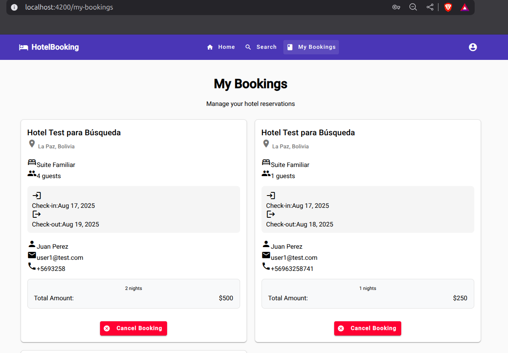
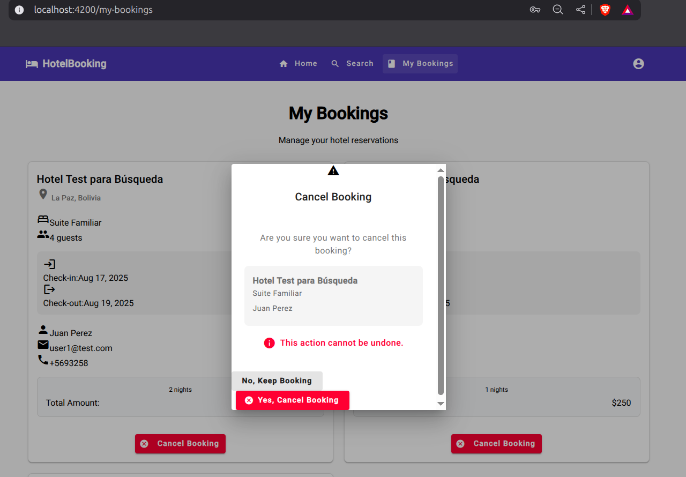
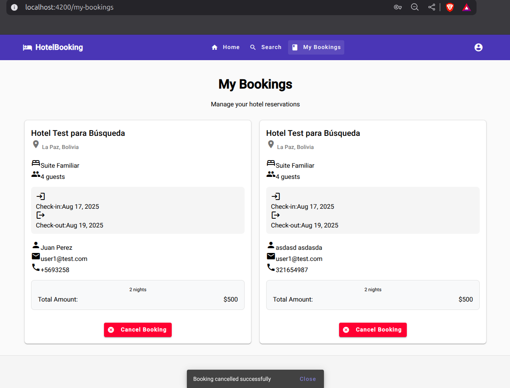
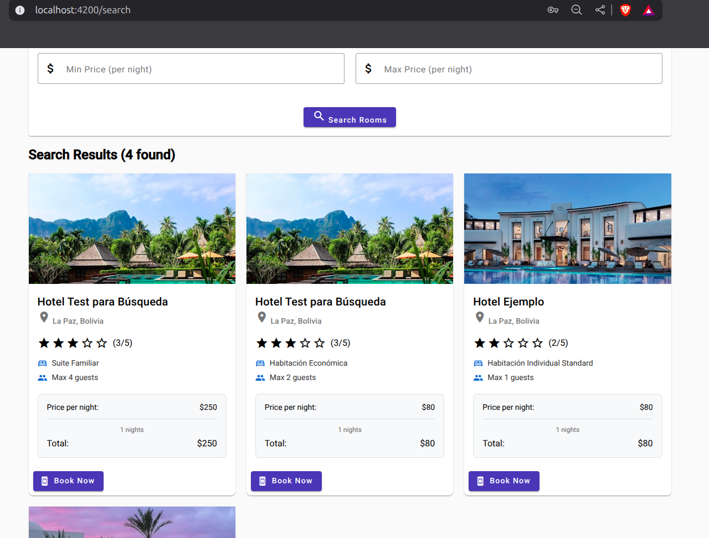
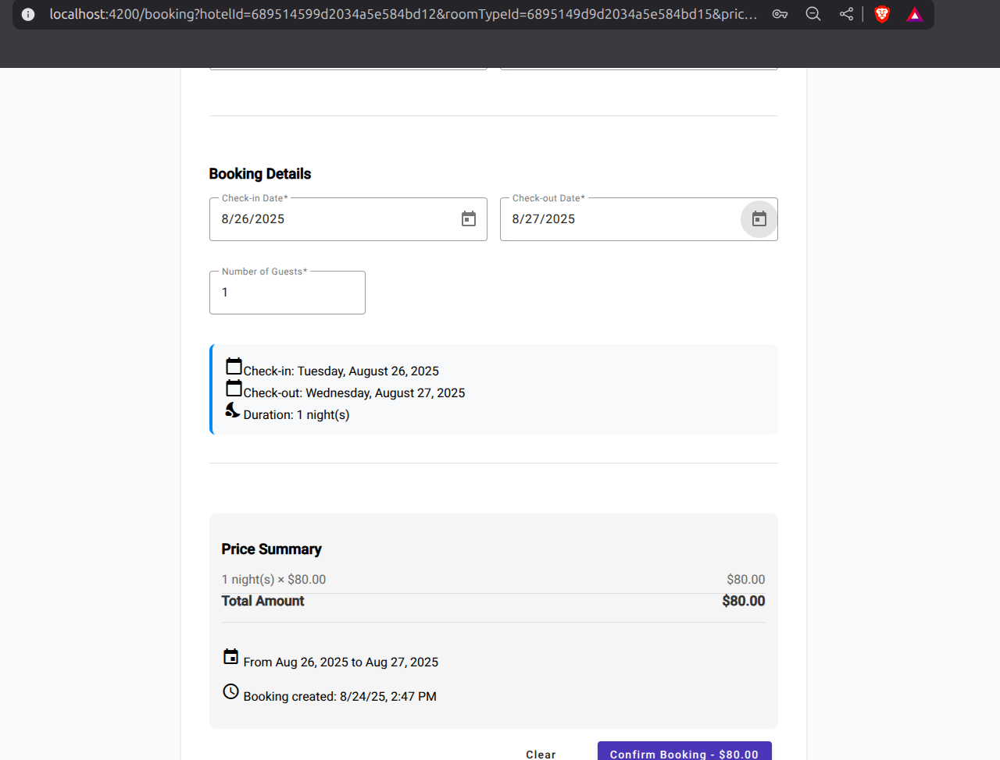
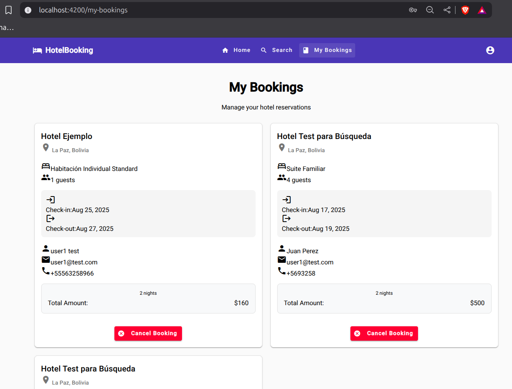

# Lab07 - Activity 1 & 3: Gestión Completa de Reservas

## Descripción
Implementación del sistema completo de gestión de reservas que incluye visualización, creación y cancelación de reservas con integración total entre componentes.

## Backend - Mejoras Implementadas

### BookingUseCases Enriquecido
```javascript
// Enriquecer bookings con información del hotel y room type
const enrichedBookings = await Promise.all(
  bookings.map(async (booking) => {
    const hotel = await this.hotelRepository.findById(booking.hotelId);
    const roomType = await this.roomTypeRepository.findById(booking.roomTypeId);
    return {
      ...booking,
      hotel: hotel ? { name: hotel.name, address: hotel.address } : null,
      roomType: roomType ? { name: roomType.name, pricePerNight: roomType.pricePerNight } : null
    };
  })
);
```

## Frontend - Componentes Implementados

### 1. MyBookingsComponent
- **Ruta**: `/my-bookings` (solo usuarios autenticados)
- Observables reactivos: `bookings$`, `isLoading$`, `error$`, `hasLoaded$`
- Integración con Keycloak para obtener email del usuario

### 2. BookingCardComponent
- Información completa: hotel, habitación, fechas, huésped, precios
- Botón de cancelación condicional
- Cálculo automático de noches

### 3. CancelBookingDialogComponent
- Modal de confirmación con resumen de reserva
- Validación antes de eliminar (acción irreversible)

### 4. Servicios Reactivos

#### MyBookingsService
```typescript
getBookingsByEmail(email: string): Observable<Booking[]>
cancelBooking(bookingId: string): Observable<any>
refreshBookings(email: string): void
```

## Flujo Completo Implementado

### A. Búsqueda → Reserva
1. **Search Page**: Filtros de búsqueda
2. **SearchResultCard**: Botón "Book Now" con parámetros
3. **BookingComponent**: Pre-llenado automático con datos de búsqueda y usuario

### B. Gestión de Reservas
1. **My Bookings**: Lista de reservas del usuario autenticado
2. **BookingCard**: Información detallada con opción de cancelar
3. **Modal Confirmación**: Seguridad antes de cancelar
4. **Actualización Automática**: Refresh tras cancelación exitosa

## Manejo de Estados y Errores

### Mensajes de Retroalimentación
```typescript
// Reserva exitosa
this.snackBar.open('Booking created successfully! We will contact you soon.', 'Close', { duration: 5000 });

// Cancelación exitosa  
this.snackBar.open('Booking cancelled successfully', 'Close', { duration: 3000 });

// Errores
this.snackBar.open('Error loading your bookings. Please try again.', 'Close', { duration: 5000 });
```

### Navegación Integrada
- Header actualizado: "My Bookings" solo para usuarios logueados
- Navegación fluida entre search → booking → my-bookings
- Guards para cambios no guardados

## Screenshots
*Capturas requeridas:*
- Vista My Bookings con reservas

- Modal de confirmación de cancelación

- Mensajes de éxito/error

- Flujo completo: búsqueda → reserva → gestión



