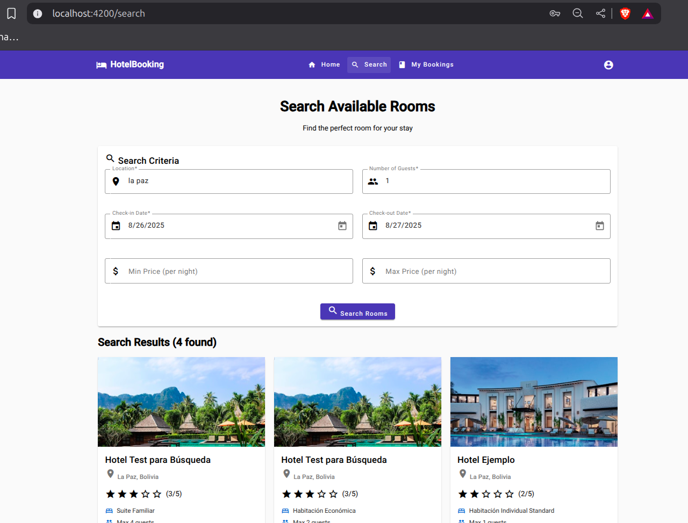

# Lab07 - Activity 2: Buscador de Habitaciones

## Descripción
Sistema de búsqueda de habitaciones con filtros avanzados, resultados enriquecidos y navegación directa al formulario de reserva.

## Implementación

### SearchComponent
- **Ruta**: `/search` (acceso público)
- Formulario reactivo con validaciones en tiempo real
- Observables: `searchResults$`, `isLoading$`, `hasSearched$`
- Filtros: ubicación, fechas, huéspedes, rango de precios

### SearchResultCardComponent
- Tarjetas con imagen, rating, información del hotel y habitación
- Precios calculados: por noche + total por estadía
- Botón "Book Now" que navega con parámetros pre-llenados

### SearchService
```typescript
searchRooms(filters: RoomSearchFilters): Observable<SearchResultItem[]>
transformSearchResults(hotelResults: HotelSearchResult[]): SearchResultItem[]
```

## Validaciones del Formulario
- **Ubicación**: Requerida, mínimo 2 caracteres
- **Fechas**: Check-out debe ser posterior a check-in
- **Huéspedes**: Entre 1 y 20
- **Precios**: Opcional, valores numéricos

## Integración Backend
```
GET /api/hotels/search?location=La%20Paz&checkInDate=2025-08-10&checkOutDate=2025-08-12&numberOfGuests=4&priceRange.min=100&priceRange.max=500
```

## Estados Manejados
- **Idle**: Formulario inicial
- **Loading**: Durante búsqueda
- **Success**: Resultados mostrados
- **Error**: Manejo de errores con mensajes
- **No Results**: Estado vacío

## Flujo de Usuario
1. Completar formulario de búsqueda
2. Ver resultados en tarjetas con información completa
3. Clic en "Book Now" → navegación a `/booking` con datos pre-llenados

## Screenshots
*Capturas requeridas:*
- Formulario de búsqueda vacío

- Formulario con validaciones de error

- Resultados de búsqueda con múltiples habitaciones


## Conclusiones
Buscador potente y fácil de usar que permite encontrar habitaciones según criterios específicos con navegación fluida hacia el proceso de reserva.
